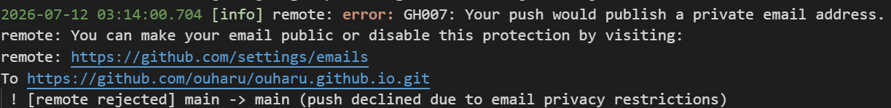
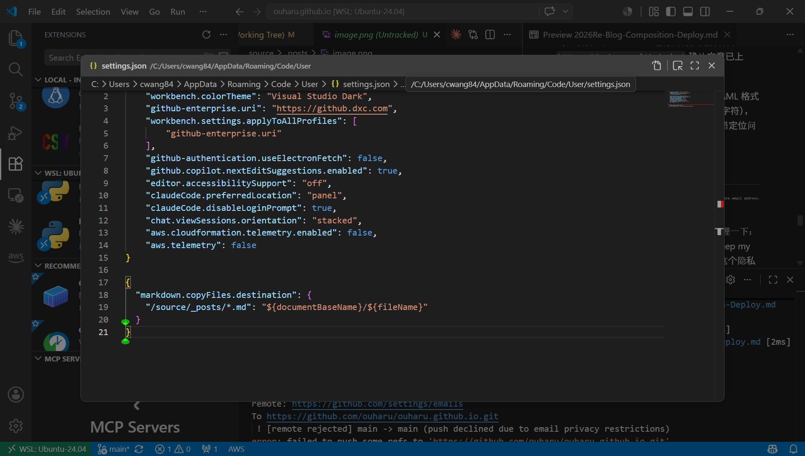

前提：已有 GitHub 仓库 `ouharu/ouharu.github.io`，本地环境从零开始搭建。使用系统为 WSL2（Ubuntu 24.04）。

参考文档：[Hexo 官方文档](https://hexo.io/zh-cn/docs/)、[Microsoft: Node.js on WSL](https://learn.microsoft.com/en-us/windows/dev-environment/javascript/nodejs-on-wsl)

## 一、技术架构

静态站点由 Hexo 生成，主题为 Fluid，托管在 GitHub Pages。仓库为 `ouharu.github.io`，源码分支为 `main`。

发布通过 GitHub Actions 完成，workflow 文件为 `.github/workflows/pages.yml`：

1. 推送到 `main` 分支触发构建
2. CI 执行 `npm install`，再执行 `npm run build`（即 `hexo generate`，将 Markdown 编译为静态 HTML）
3. 构建产物经 `upload-pages-artifact` 和 `deploy-pages` 发布到 GitHub Pages

本地不需要保留构建环境，push 之后由 CI 完成全部构建和部署。

## 二、环境安装（WSL）

### 1. 安装 Git

```bash
git --version
```

WSL 的 Ubuntu 通常已预装 Git，未安装则执行：
```bash
sudo apt-get install git
```

### 2. 安装 nvm，再用 nvm 安装 Node.js

WSL 环境下推荐用 nvm 管理 Node 版本，而不是直接装官方安装包：

```bash
curl -o- https://raw.githubusercontent.com/nvm-sh/nvm/master/install.sh | bash
```

安装完成后关闭终端重新打开（或手动 `source ~/.bashrc`），使 nvm 生效。验证：

```bash
command -v nvm
```
返回 `nvm` 说明安装成功。

安装 LTS 版本 Node：

```bash
nvm install --lts
```

验证版本：

```bash
node --version   # v24.18.0
npm --version    # 11.16.0
```

### 3. 配置 Git 身份信息

```bash
git config --global user.name "cwang"
git config --global user.email "abc.x@ouharu.xx"
```

Git 要求每次提交都绑定一个作者身份，这是版本控制机制的一部分，与是否使用 GitHub 无关。此项一次性配置，全局生效。

## 三、克隆仓库并安装依赖

### 1. 克隆仓库

VS Code 中 `Cmd/Ctrl + Shift + P` → `Git: Clone`，粘贴：
```
https://github.com/ouharu/ouharu.github.io.git
```
选择本地目录。首次克隆需登录 GitHub 账号授权，这一步同时是后续 `git push` 能成功推送的前提。

### 2. 安装依赖

```bash
npm install
```

执行后会有若干 `deprecated` 警告和安全漏洞提示，均为 Hexo 依赖链自带，不影响功能，无需处理。

需要额外处理的是脚本审批提示：

```
npm warn allow-scripts 1 package has install scripts not yet covered by allowScripts:
npm warn allow-scripts   hexo-util@3.3.0 (postinstall: npm run build:highlight)
```

执行：

```bash
npm approve-scripts hexo-util
```

批准后 `package.json` 会自动追加 `allowScripts` 字段记录已批准的包：

```json
"allowScripts": {
  "hexo-util@2.7.0": true,
  "hexo-util@3.3.0": true
}
```

这一改动应随其他改动一并提交推送。

## 四、CI Node 版本对齐

本地通过 nvm 安装的是 Node 24，而仓库 `.github/workflows/pages.yml` 中原先写的是：

```yaml
node-version: '20'
```

本地与 CI 版本不一致虽不一定报错，但为避免"本地正常、CI 构建失败"的情况，统一改成 24：

```yaml
- name: Use Node.js 24
  uses: actions/setup-node@v4
  with:
    node-version: '24'
```

原则：本地版本是既定事实，workflow 里的版本号应随本地调整，而不是反过来迁就 workflow 里已写好的数字。改动后需提交推送，Actions 会自动跑一次构建验证。

## 五、写新文章

### 1. 新建文章

```bash
npx hexo new "文章标题"
```

`npx` 用于执行当前项目 `node_modules/.bin/` 里的工具，不依赖全局安装。

标题中若包含冒号、`&`、空格等符号，生成的**文件名**会被自动清理替换为 `-`，但 Front Matter 中的 `title` 字段会保留原始标题。

### 2. Front Matter 注意事项

若标题本身包含冒号（如 `2026Re:Blog_Composition_&_Deploy`），YAML 会将冒号解析为键值分隔符，导致解析异常，需要给 `title` 值加双引号：

```yaml
title: "2026Re:Blog_Composition_&_Deploy"
```

标题若用下划线连接多个单词且没有空格，浏览器会将其视为不可分割的长单词，标题栏宽度不足时会被截断显示不全。建议用空格分隔：

```yaml
title: "2026 Re: Blog Composition & Deploy"
```

### 3. 自定义 `hexo new` 模板

模板文件位于 `scaffolds/post.md`，控制 `hexo new` 生成文章时的默认 Front Matter 内容。修改后立即生效，无需重启或重新安装。

`{{ title }}` 和 `{{ date }}` 是模板变量，执行 `hexo new` 时自动替换，其余字段可自由增删。当前模板：

```markdown
---
title: {{ title }}
tags:
  -
categories:
  - Diary
  - Work
category_bar: true
math: true
date: {{ date }}
---

## 模板便签（不需要可删）

文字或者 `markdown` 均可；
可选便签：
primary
secondary

```

末尾追加了一段便签提示，作为写作时的格式提醒，正式发布前删除即可。

## 六、图片管理

仓库 `_config.yml` 开启：
```yaml
post_asset_folder: true
```

此配置仅在使用 `hexo new` 命令新建文章时生效，会自动生成与文章同名的配图文件夹：

```
source/_posts/
  ├── 文章标题.md
  └── 文章标题/          ← 配图放这里，正文中直接以文件名引用
```

站点级别的图片（头像、背景图等，与具体文章无关）放在 `source/img/`，配置中以绝对路径引用，如 `/img/avatar.png`。

## 七、主题配置调整记录

以下为本次重启时对 `_config.fluid.yml` 做的修改：

**开启 Mermaid 流程图支持：**
```yaml
mermaid:
  enable: true
```

## 八、本地预览

```bash
npx hexo clean && npx hexo server
```

访问 `http://localhost:4000` 检查排版、图片、流程图等渲染效果，确认无误后 `Ctrl+C` 停止。

## 九、提交并推送

VS Code 左侧「源代码管理」面板：

1. 暂存改动文件
2. 填写 commit message
3. 提交
4. 同步更改（推送到 `main`）

## 十、确认部署结果

访问：
```
https://github.com/ouharu/ouharu.github.io/actions
```
确认最新一次 workflow 运行成功，随后访问 `https://ouharu.github.io/` 确认文章已上线。

构建失败（红叉）多为 Front Matter 中 YAML 格式错误（缩进、多余符号、未加引号的特殊字符），可在对应 Actions 运行记录中查看具体报错定位问题。

## 十一、 push失败小结

这次推送失败的完整脉络，按发生顺序梳理一下：
问题根源
在 GitHub 账号设置里开启了"Keep my email address private"（保持邮箱私密）这个隐私保护功能。这个功能会让 GitHub 拒绝任何 commit 中带有你真实邮箱地址的推送，防止邮箱通过公开仓库的提交记录泄露。
而你最初配置 Git 身份时用的是真实邮箱：
bashgit config --global user.email "abc.x@ouharu.xx"
这个邮箱和 GitHub 账号绑定邮箱一致，所以第一次 git push 就被服务器拒绝了：
remote: error: GH007: Your push would publish a private email address.
第一次尝试的误区
发现问题后，只是把全局配置改成了 GitHub 提供的无回复邮箱：
bashgit config --global user.email "58501286+ouharu@users.noreply.github.com"
但推送依然失败。原因是 git config --global 只影响以后新产生的 commit，不会追溯修改已经存在的 commit。而当时要推送的那个 commit（新增博客文章那次），是在改配置之前就已经生成的，commit 内部固化记录的作者邮箱还是旧的真实邮箱，所以推送还是被拒绝。
第二次尝试的语法错误
意识到需要修正已存在的 commit 后，用 --amend 重写作者信息，但漏写了尖括号：
bashgit commit --amend --author="cwang 58501286+ouharu@users.noreply.github.com" --no-edit
Git 的 --author 参数要求严格的 Name <email> 格式，邮箱必须用尖括号包住，用来区分名字和邮箱两部分。少了尖括号，Git 没法解析这个字符串，报错：
fatal: --author '...' is not 'Name <email>' and matches no existing author
最终解决
补上尖括号，命令写对：
bashgit commit --amend --author="cwang <58501286+ouharu@users.noreply.github.com>" --no-edit
从你贴的终端截图看，这次 --amend 执行成功了（能看到 [main 6c50008] ... 的提交信息输出），说明已经把 commit 的作者信息重写成了无回复邮箱，接下来再执行 git push origin main 就能正常推送了。
这次问题带来的经验
以后新建 GitHub 账号或者新电脑第一次配置 Git 身份时，直接从一开始就用 noreply 邮箱，可以避免这整个折腾过程：
bashgit config --global user.email "58501286+ouharu@users.noreply.github.com"
这样从第一个 commit 开始就不会踩到隐私保护这个坑。


## 十二、 图片粘贴路径问题


在user setting json添加图片中代码:

```json
"markdown.copyFiles.destination": {
    "/source/_posts/*.md": "${documentBaseName}/${fileName}"
  }
```

***

(end)