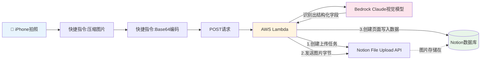


每次买完东西,票据要么随手丢了,要么攒成一沓,想统计一下每月花在餐饮、超市、数码上的钱,最后往往不了了之。这篇文章记录我如何用一套几乎全自动化的流程,把"拍照"这一个动作,变成一条结构化的Notion账单记录。

整体思路很简单:
`
iPhone拍照 → 压缩 → 传给AWS Lambda → Lambda调用Bedrock上的Claude视觉模型识别小票 → 结构化结果写入Notion数据库
`
全程不需要手动录入任何数字,拍完照几秒钟后,Notion里就多了一条带图片、带商家名、带金额分类的完整记录。



## 一、整体架构

先上一张架构图,把整条链路的每一环都画出来:



图中可以看到,整条链路只有一次网络请求从手机发出(拍照→压缩→编码→POST),剩下所有的复杂逻辑(调用Bedrock、三段式上传Notion)全部封装在Lambda内部,手机端不需要感知这些细节。

在设计之初,有几个关键决策点:

### 1. 用AI视觉识别,而非传统OCR

传统OCR(如Textract的AnalyzeExpense)对规整的票据识别效果不错,但字段是固定的,遇到手写、模糊、非标准格式的小票容错率较低。直接用Bedrock上的Claude视觉模型,可以让AI"理解"小票内容,自己判断分类、拼接商品清单,灵活性更高。

### 2. 图片不落地S3,直接在Lambda内存中流转

图片全程走向是:iPhone → Lambda(内存)→ Notion自己的文件存储。不经过S3这一层,减少了一个存储环节和相关的管理成本。

### 3. 手机端只做"拍照+发送",逻辑全部收敛到Lambda

早期我在快捷指令里直接调用Notion的三段式File Upload API(创建上传任务→发送文件→创建页面),验证链路可行后,把这部分逻辑整体迁移到Lambda里,手机端只需要一次网络请求。

---

## 二、Notion数据库设计

数据库包含以下字段:

| 字段名 | 类型 | 说明 |
|---|---|---|
| 商家(Title) | 标题 | AI识别出的店名 |
| 日期 | Date | 小票上的消费时间 |
| 总金额 | Number | 含税总额 |
| 分类 | Select | 餐饮/超市/数码/缴费/其他 |
| 支付方式 | Select | 信用卡/現金/手机支付/其他 |
| 商品明细 | Text | AI拼接的"商品名 价格 数量"列表 |
| 小票原图 | Files & media | 直传Notion自己的存储,不经S3 |
| 记录创建时间 | Created time | Notion自动记录,不需要代码写入 |

**几个设计上的取舍:**

- 商品条目数量不固定(有的小票只有一件商品,有的有十几件),所以用一个多行文本字段拼接展示,而不是拆成"商品1/商品2..."这种固定列
- "记录创建时间"用Notion原生的Created time类型,创建页面时自动生成,不需要在代码里手动传时间戳,零维护成本

---

## 三、Notion API配置

### 1. 创建Integration,获取Token

Notion的自动化写入,依赖一个叫"Integration"(或者叫"Connection",不同版本UI叫法略有差异)的机制,本质上是一个专属的API访问凭证。

1. 打开 [notion.so/my-integrations](https://www.notion.so/my-integrations)
2. 点"+ New integration",填写名称,选择关联的workspace
3. 创建后,进入配置页面,找到"Internal Integration Secret"这一栏,点"Show"显示出来
4. 复制这个token——新建的token是`ntn_`开头(旧版本是`secret_`开头,仍然有效)

**安全提示**:这个token拥有对workspace的写入权限,绝对不能提交到代码仓库、不能贴在聊天记录或者任何公开场合。如果不小心泄露了,要立刻回到这个页面重置(Refresh)。

### 2. 把Integration连接到目标数据库

仅仅创建了Integration还不够,必须显式把它"连接"到你想操作的具体数据库,否则调用API时会收到权限错误。

1. 打开你要写入的Notion数据库页面(整页视图)
2. 右上角点"..."(三个点菜单)
3. 找到"Connect to"(部分版本叫"Add connections")
4. 搜索并选中你创建的Integration

### 3. 获取数据库ID

1. 打开这个数据库的整页视图
2. 复制浏览器地址栏的URL,形如:
   ```
   https://www.notion.so/xxxxxxxxxxxxxxxxxxxxxxxxxxxxxxxx?v=yyyyyyyy
   ```
3. `notion.so/`后面到`?v=`前面那段32位字符,就是数据库ID(有没有横杠都可以)

### 4. 每次API请求必带的Headers

```
Authorization: Bearer {你的token}
Notion-Version: 2026-03-11
Content-Type: application/json
```

Notion的API是按版本迭代的,`Notion-Version`这个头必须显式声明,不同版本之间字段结构可能有差异(比如后期引入的"data source"概念,对多数据源的database有影响)。

---

## 四、Notion API踩坑记录

### 401 Unauthorized:token放错了位置

第一次调试时一直收到401报错,排查后发现:**Authorization和Notion-Version被错误地放进了"请求体(JSON)"里,而不是"请求头(Headers)"里**。这两个信息属于HTTP协议层面的元数据,必须放在Headers,放进body里服务器完全读不到。

### JSON嵌套结构:字典模式下容易迷路

Notion创建页面的请求体是深层嵌套的(parent→properties→商家→title→数组→词典→text→content),在快捷指令这种"字典模式"的界面里手动搭建,很容易把某个字段放错层级(比如误把properties塞进了parent里面)。建议每加一层,就退出来截图核对一次结构。

---

## 五、Lambda + Bedrock 核心代码

### 整体流程

```python
def lambda_handler(event, context):
    # 1. 解析请求体,拿到Base64图片
    image_bytes = base64.b64decode(image_b64)

    # 2. 调用Bedrock Claude视觉模型,识别小票内容
    extracted = _extract_receipt_fields(image_bytes)

    # 3. 三步上传到Notion:创建上传任务 → 发送图片 → 创建页面
    file_upload_info = _notion_create_file_upload()
    upload_result = _notion_send_file(file_upload_info, image_bytes)
    page = _notion_create_page(extracted, file_upload_info)

    return _response(200, {...})
```

### 自动检测图片格式,而非写死JPEG

考虑到以后可能遇到不同来源的图片(不只是iPhone直接拍照),加了一个基于文件头字节判断真实格式的函数:

```python
def _detect_media_type(image_bytes):
    """根据图片二进制头部字节,自动判断真实的图片格式"""
    if image_bytes[:8] == b"\x89PNG\r\n\x1a\n":
        return "image/png"
    if image_bytes[:3] == b"\xff\xd8\xff":
        return "image/jpeg"
    if image_bytes[:6] in (b"GIF87a", b"GIF89a"):
        return "image/gif"
    if image_bytes[:4] == b"RIFF" and image_bytes[8:12] == b"WEBP":
        return "image/webp"
    return "image/jpeg"
```

这样不管图片实际是什么格式,调Bedrock和传Notion时都会用正确的media_type,不会因为类型不匹配而报错。

### Prompt设计:明确告知每个字段的数据类型

调试中踩过一个坑:prompt里给`total_amount`的示例值加了引号,导致AI把它当成字符串返回(`"1617"`而非`1617`),写入Notion时因为类型不匹配直接报错。

修复方式是双重保险:

1. **JSON模板本身不给total_amount加引号**,暗示这里应该是数字
2. **额外用自然语言明确写出每个字段的类型要求**:

```
各字段的数据类型要求(务必严格遵守):
- merchant: 字符串(string),用双引号包裹
- total_amount: 数字(number),不加引号,不带货币符号或千分位逗号
...
```

3. **代码层面再加一层防御性转换**,即便AI偶尔还是返回字符串,也能自动纠正:

```python
if extracted.get("total_amount") is not None:
    try:
        properties["总金额"] = {"number": float(extracted["total_amount"])}
    except (TypeError, ValueError):
        pass
```

### 错误处理:让HTTP错误的详细信息不被吞掉

早期`except Exception as e: return _response(500, {"error": str(e)})`这种写法,对于`urllib.error.HTTPError`只会打印出"HTTP Error 400: Bad Request"这种毫无信息量的提示。改成专门捕获这个异常类型,把响应体读出来:

```python
except urllib.error.HTTPError as e:
    error_detail = e.read().decode("utf-8")
    return _response(500, {"error": f"HTTP {e.code}: {error_detail}"})
```

这样调试效率大幅提升,能直接看到Notion API返回的具体校验失败原因。

---

## 六、最终效果

拍一张真实的小票,几秒后Lambda返回:

```json
{
  "status": "success",
  "notion_page_url": "https://app.notion.com/p/...",
  "extracted": {
    "merchant": "はま寿司(Hamazushi)都島本通店",
    "date": "2018-04-03T20:36:00",
    "total_amount": 1617,
    "category": "餐饮",
    "payment_method": "現金",
    "items": "平日寿司皿90円 x15 ¥1,455\n寿司皿150円 x1 ¥162"
  },
  "image_upload": {
    "status": "uploaded",
    "filename": "receipt.jpeg",
    "content_type": "image/jpeg",
    "content_length": 524021
  }
}
```

对应地,Notion数据库里同步出现一条完整记录,商家名、金额、分类全部自动填好,还能点开查看原始小票图片。

---

## 七、经验总结

1. **先手动跑通,再自动化**:一开始在快捷指令里手动调三次Notion API,虽然繁琐,但让我彻底理解了File Upload API的完整流程,后续搬到Lambda时debug效率高很多
2. **AI的输出格式,要靠明确指令而非隐晦暗示**:prompt里的示例格式(带不带引号)会直接影响AI的输出类型,与其让AI"猜",不如直接用自然语言写清楚类型要求
3. **日期时间一定要显式规定时区**:AI从图片上识别出的时间字符串本身不带时区信息,如果不在prompt里明确要求(比如固定加上`+09:00`),Notion按UTC或默认时区解读时,存进去的时间可能会跟小票上写的对不上,产生几个小时的偏差
4. **代码里的防御性写法值得投入**:图片格式检测、数字类型转换,这些"看似多余"的代码,恰恰是应对真实世界数据不规整的关键
5. **错误信息要完整暴露,不要吞掉细节**:排查问题时,笼统的"HTTP 400"和具体的校验失败原因,debug效率天差地别

---

## 附:完整Lambda代码

```python
import json
import base64
import os
import urllib.request
import urllib.error
import uuid
import boto3

# ---- 配置 ----
NOTION_TOKEN = os.environ["NOTION_TOKEN"]
NOTION_DATABASE_ID = os.environ["NOTION_DATABASE_ID"]
NOTION_VERSION = "2026-03-11"
BEDROCK_MODEL_ID = os.environ["BEDROCK_MODEL_ID"]

bedrock = boto3.client("bedrock-runtime", region_name="ap-northeast-1")


def lambda_handler(event, context):
    try:
        # 1. 解析请求体,拿到Base64图片
        body = json.loads(event["body"]) if isinstance(event.get("body"), str) else event.get("body", {})
        image_b64 = body.get("image")
        if not image_b64:
            return _response(400, {"error": "缺少image字段"})

        image_bytes = base64.b64decode(image_b64)

        # 2. 调用Bedrock Claude视觉模型,识别小票内容
        extracted = _extract_receipt_fields(image_bytes)

        # 3. 三步上传到Notion:创建上传任务 → 发送图片 → 创建页面
        file_upload_info = _notion_create_file_upload()
        upload_result = _notion_send_file(file_upload_info, image_bytes)
        page = _notion_create_page(extracted, file_upload_info)

        return _response(200, {
            "status": "success",
            "notion_page_url": page.get("url"),
            "extracted": extracted,
            "image_upload": {
                "status": upload_result.get("status"),
                "filename": upload_result.get("filename"),
                "content_type": upload_result.get("content_type"),
                "content_length": upload_result.get("content_length")
            }
        })

    except urllib.error.HTTPError as e:
        error_detail = e.read().decode("utf-8")
        return _response(500, {"error": f"HTTP {e.code}: {error_detail}"})
    except Exception as e:
        return _response(500, {"error": str(e)})


def _detect_media_type(image_bytes):
    """根据图片二进制头部字节,自动判断真实的图片格式"""
    if image_bytes[:8] == b"\x89PNG\r\n\x1a\n":
        return "image/png"
    if image_bytes[:3] == b"\xff\xd8\xff":
        return "image/jpeg"
    if image_bytes[:6] in (b"GIF87a", b"GIF89a"):
        return "image/gif"
    if image_bytes[:4] == b"RIFF" and image_bytes[8:12] == b"WEBP":
        return "image/webp"
    # 默认按JPEG处理(iPhone快捷指令拍照后压缩,通常就是JPEG)
    return "image/jpeg"


def _extract_receipt_fields(image_bytes):
    """调用Bedrock Claude视觉模型,提取小票结构化字段"""
    image_b64 = base64.b64encode(image_bytes).decode("utf-8")
    media_type = _detect_media_type(image_bytes)

    prompt = """请分析这张购物小票图片,提取以下字段,严格按照JSON格式返回,不要包含任何其他文字说明或markdown标记:

{
  "merchant": "商家名称",
  "date": "YYYY-MM-DDTHH:MM:SS+09:00格式的日期时间,固定带上+09:00时区偏移,如果小票上没有具体时间只有日期,时间部分填00:00:00",
  "total_amount": 含税总金额的数字(不含货币符号,不加引号),
  "category": "根据商家和商品判断的分类,从这些选项里选一个:餐饮/超市/数码/缴费/其他",
  "payment_method": "支付方式,从这些选项里选一个:信用卡/現金/手机支付/其他",
  "items": "商品明细,每行一个商品价格以及数量,用换行符分隔,格式如:商品名 价格 数量"
}

各字段的数据类型要求(务必严格遵守):
- merchant: 字符串(string),用双引号包裹
- date: 字符串(string),用双引号包裹
- total_amount: 数字(number),不加引号,不带货币符号或千分位逗号,例如 1617 或 1617.5
- category: 字符串(string),用双引号包裹
- payment_method: 字符串(string),用双引号包裹
- items: 字符串(string),用双引号包裹

如果某个字段无法从图片中识别,对应值设为null。总金额如果看到多个数字,优先使用"合计"或"总计"这一行的最终金额。"""

    request_body = {
        "anthropic_version": "bedrock-2023-05-31",
        "max_tokens": 1024,
        "messages": [
            {
                "role": "user",
                "content": [
                    {
                        "type": "image",
                        "source": {
                            "type": "base64",
                            "media_type": media_type,
                            "data": image_b64
                        }
                    },
                    {
                        "type": "text",
                        "text": prompt
                    }
                ]
            }
        ]
    }

    response = bedrock.invoke_model(
        modelId=BEDROCK_MODEL_ID,
        body=json.dumps(request_body)
    )

    response_body = json.loads(response["body"].read())
    text_output = response_body["content"][0]["text"]

    # 清理可能的markdown代码块标记
    text_output = text_output.strip()
    if text_output.startswith("```"):
        text_output = text_output.split("```")[1]
        if text_output.startswith("json"):
            text_output = text_output[4:]
        text_output = text_output.strip()

    return json.loads(text_output)


def _notion_create_file_upload():
    """第一步:创建Notion文件上传任务,返回file_upload_id"""
    req = urllib.request.Request(
        "https://api.notion.com/v1/file_uploads",
        data=json.dumps({}).encode("utf-8"),
        headers=_notion_headers(),
        method="POST"
    )
    with urllib.request.urlopen(req) as resp:
        result = json.loads(resp.read())
    return result["id"], result["upload_url"]


def _notion_send_file(file_upload_info, image_bytes):
    """第二步:把图片字节发送到upload_url(multipart/form-data)"""
    file_upload_id, upload_url = file_upload_info
    boundary = uuid.uuid4().hex
    media_type = _detect_media_type(image_bytes)
    extension = media_type.split("/")[1]

    body = (
        f"--{boundary}\r\n"
        f'Content-Disposition: form-data; name="file"; filename="receipt.{extension}"\r\n'
        f"Content-Type: {media_type}\r\n\r\n"
    ).encode("utf-8") + image_bytes + f"\r\n--{boundary}--\r\n".encode("utf-8")

    headers = {
        "Authorization": f"Bearer {NOTION_TOKEN}",
        "Notion-Version": NOTION_VERSION,
        "Content-Type": f"multipart/form-data; boundary={boundary}"
    }

    req = urllib.request.Request(upload_url, data=body, headers=headers, method="POST")
    with urllib.request.urlopen(req) as resp:
        return json.loads(resp.read())


def _notion_create_page(extracted, file_upload_info):
    """第三步:创建Notion页面,写入结构化数据+图片"""
    file_upload_id, _ = file_upload_info

    properties = {
        "商家": {
            "title": [{"text": {"content": extracted.get("merchant") or "未知商家"}}]
        },
        "小票原图": {
            "files": [{"type": "file_upload", "file_upload": {"id": file_upload_id}}]
        }
    }

    if extracted.get("date"):
        properties["日期"] = {"date": {"start": extracted["date"]}}

    if extracted.get("total_amount") is not None:
        try:
            properties["总金额"] = {"number": float(extracted["total_amount"])}
        except (TypeError, ValueError):
            pass

    if extracted.get("category"):
        properties["分类"] = {"select": {"name": extracted["category"]}}

    if extracted.get("payment_method"):
        properties["支付方式"] = {"select": {"name": extracted["payment_method"]}}

    if extracted.get("items"):
        properties["商品明细"] = {"rich_text": [{"text": {"content": extracted["items"]}}]}

    payload = {
        "parent": {"database_id": NOTION_DATABASE_ID},
        "properties": properties
    }

    req = urllib.request.Request(
        "https://api.notion.com/v1/pages",
        data=json.dumps(payload).encode("utf-8"),
        headers=_notion_headers(),
        method="POST"
    )
    with urllib.request.urlopen(req) as resp:
        return json.loads(resp.read())


def _notion_headers():
    return {
        "Authorization": f"Bearer {NOTION_TOKEN}",
        "Notion-Version": NOTION_VERSION,
        "Content-Type": "application/json"
    }


def _response(status_code, body_dict):
    return {
        "statusCode": status_code,
        "headers": {"Content-Type": "application/json"},
        "body": json.dumps(body_dict, ensure_ascii=False)
    }
```