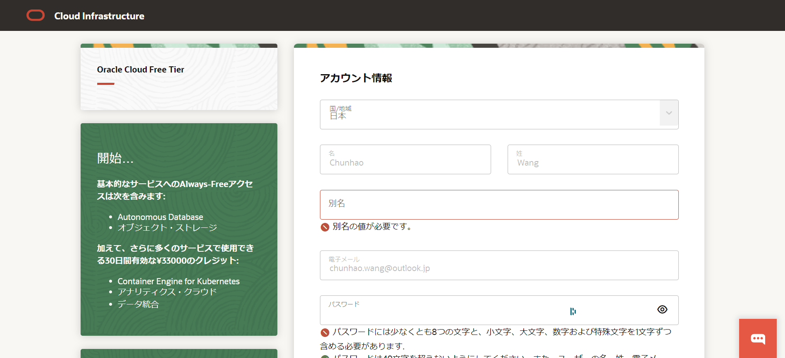

> 参考：https://www.ibeg.eu.org/2024/03/13/alwaysfree2/#toc-head-14

# 1. 打开网址

https://www.oracle.com/cn/cloud/free/

立即免费试用

# 2. 注册基本信息

接收验证邮件，添加账户信息

注意：home region选择上，东京和首尔被大量注册，Arm Ampere A1 Compute 实例可用性被限制，需要选择其他区域。(此处我选择大版)

住所信息的填写，与信用卡账单地址一致

添加支付方法，用国外标识的信用卡进行验证（注意整个注册过程要在30分钟内完成）

