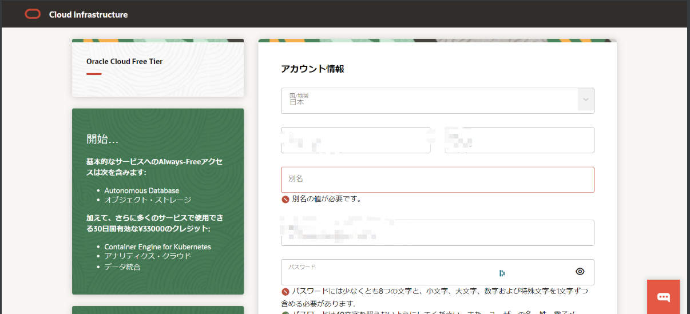

> 参考：https://www.ibeg.eu.org/2024/03/13/alwaysfree2/#toc-head-14

强烈建议用手机+移动网络注册，本人在日本用连WiFi注册失败，电脑注册失败。

# 1. 打开网址

https://www.oracle.com/cn/cloud/free/
⚠️不要挂vpn，地区与实际所在地保持一致

立即免费试用

# 2. 注册基本信息

地区与本人实际所在地一致，邮箱不要与之前注册失败的邮箱相同，接收验证邮件(建议用谷歌手机浏览器直接点击验证链接操作，多次打开链接会失效)，添加账户信息

注意：home region选择上，东京和首尔被大量注册，Arm Ampere A1 Compute 实例可用性被限制，需要选择其他区域。
⚠️我选择大阪，注册失败，新加坡成功)

住所信息的填写，与信用卡账单地址一致，未验证手机号，但注意若注册测试失败，要换成与原来手机号不同的号码

添加支付方法，用国外标识的信用卡进行验证，我这里使用jcb，会有155日元的扣款验证，扣完即退回（⚠️整个注册过程要在30分钟内完成）
注册完成，账号创建等待页面：

# 3. 总结

8月末用不同邮箱信用卡在自家注册多次均失败。9/14跑到公司连接wifi用手机注册，第一次失败，更好手机号+region（大阪=>新加坡）+移动数据，注册成功。

---

完