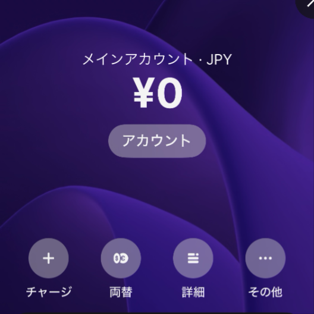
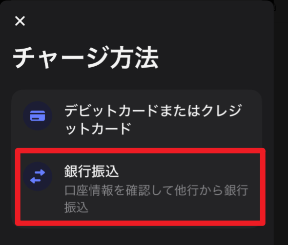
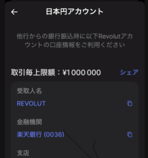
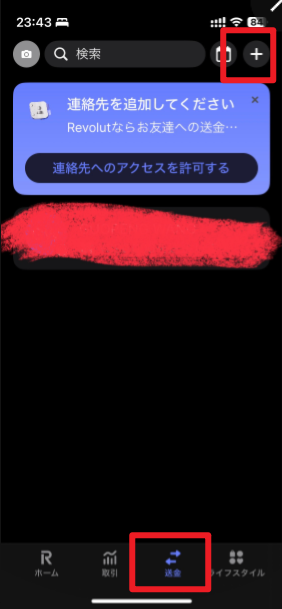
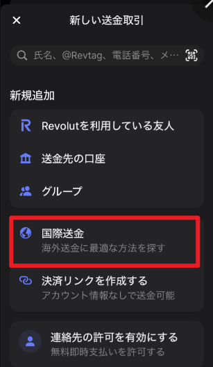
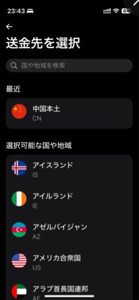
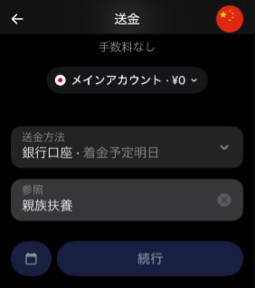

声明：本文完成于2024年9月3日，如情况发生变化，请使用下方评论提醒更新。

### **引言**

- 信息来源于小红书，介绍了日本到国内进行国际转账通过什么途径**手续费最低**以及如何保证对方**收到的是日元**而非转换为人民币（毕竟现在日元汇率低）。
- 目的是转账给国内亲属的账户获取转账证明后，满足报税时的**亲属抚养扣除**条件，可以减免在日所得税款，并且希望该过程的费用足够低，国内账户获取的日元取出后可以带回日本再次利用。
- [Revolut](https://www.revolut.com/ja-JP/)的standard级别的plan每月免费（2024此时），保证进行**国际转账Revolut不收取任何费用**（日本亲属抚养的最低证明限额38万符合此要求）

### **准备工作**

- **注册Revolut账户**
    - 下载app，注册时重点上传身份证明和**my number**
    - 需要2小时左右完成用户身份验证

### 转账步骤

**充值Revolut账户**：

- 从日本的银行账户向Revolut账户充值

    - 使用银行转账方式，每个账户有对应的乐天银行法人账户，向该账户转账，1小时内金额到账Revolut账户。

    
    

    
    

**选择转账功能**：

- 在Revolut应用中找到国际送金功能。
- 选择转账币种（日元）。
- 转账目的：親族扶養
- 
    
    
    

**输入国内银行账户信息**：

- 说明如何输入中国银行的账户信息（本人亲属使用中国银行）
    - 包括账户持有人姓名、银行卡号、SWIFT代码（查询swift code：https://wise.com/gb/swift-codes/ ， 国内中国银行通用代码：BKCHCNBJXXX）、地址(保证与公证书保持一致，建议英文填写)。

**确认与发送**：

- 最后检查信息，确认转账细节，并点击发送。

### **预计到账时间**

- 从Revolut转账到中国银行的预计处理时间。
    - 经测试3-4工作日左右到账
    - 中国银行未收取任何手续费，即无任何手续费

###  ---

完