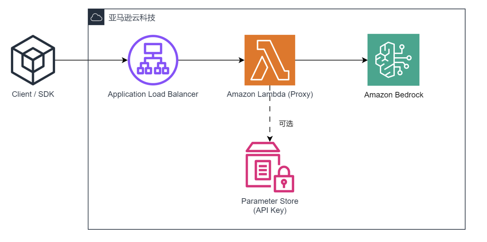
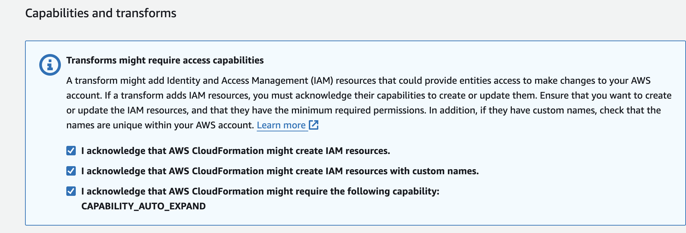


参考：[通过 Bedrock Access Gateway 解决方案快速访问 Amazon Bedrock 的多种大语言模型](https://aws.amazon.com/cn/blogs/china/quickly-access-multiple-llms-with-the-bedrock-access-gateway-solution/)


# 背景

Amazon Bedrock 服务支持一系列领先的基础模型，与 OpenAI 的 GPT-4 等模型相比，其中的 Claude3 在保持高性能水平的同时，还能为客户带来更低的使用成本。
目前市场上有很多可直接调用OpenAI的API使用生成式AI的client，但并不直接支持调用Amazon Bedrock API。
可以使用Bedrock Access Gateway（BAG）解决方案实现不更改应用代码的情况下，兼容OpenAI API代理，把OpenAI API的调用转发到 Bedrock。

# 方案架构



BAG 采用无服务器 （Serverless）架构

- Application Load Balancer（ALB）对外提供访问，由 Amazon Lambda 处理 API 请求，用户不需要登录或管理后台服务器。
- 通过修改 Lambda 的环境变量 DEFAULT_MODEL 来指定默认模型。
- Parameter Store 服务存储 API Key 参数，该参数的值用于 API 访问的认证。

# 方案实现

## 1. **创建自定义** API Key

> https://github.com/aws-samples/bedrock-access-gateway

1. Open the AWS Management Console and navigate to the Systems Manager service.
2. In the left-hand navigation pane, click on "Parameter Store".
3. Click on the "Create parameter" button.
4. In the "Create parameter" window, select the following options:
   - Name: Enter a descriptive name for your parameter (e.g., "BedrockProxyAPIKey").
   - Description: Optionally, provide a description for the parameter.
   - Tier: Select **Standard**.
   - Type: Select **SecureString**.
   - KMS key id： aws/ssm
   - Value: Any string (without spaces).
5. Click "Create parameter".
6. Make a note of the parameter name you used (e.g., "BedrockProxyAPIKey"). You'll need this in the next step.

## 2. **部署** Amazon CloudFormation 堆栈

部署后可生成ALB，Lambda

> https://console.aws.amazon.com/cloudformation/home#/stacks/create/template?stackName=BedrockProxyAPI&templateURL=https://aws-gcr-solutions.s3.amazonaws.com/bedrock-access-gateway/latest/BedrockProxy.template

一直next step，acknowledge全选



## 部署代码需要修改

- 公司账户不支持创建VPC和IGW
- 需要指定其他资源指向默认创建的VPC、IGW

部署代码解析：

```yaml
{
  "Description": "Bedrock Access Gateway - OpenAI-compatible RESTful APIs for Amazon Bedrock",
  "Transform": "AWS::LanguageExtensions",
  
  "Parameters": {
    "ApiKeyParam": {
      "Type": "String",
      "Default": "",
      "Description": "The parameter name in System Manager used to store the API Key, leave blank to use a default key"
    }
  },
  
  "Resources": {
    # 创建VPC
    "VPCB9E5F0B4": {
      "Type": "AWS::EC2::VPC",
      "Properties": {
        "CidrBlock": "10.250.0.0/16",
        "EnableDnsHostnames": true,
        "EnableDnsSupport": true,
        "InstanceTenancy": "default",
        "Tags": [
          {
            "Key": "Name",
            "Value": "BedrockProxy/VPC"
          }
        ]
      }
    },
    
    # 创建公共子网1
    "VPCPublicSubnet1SubnetB4246D30": {
      "Type": "AWS::EC2::Subnet",
      "Properties": {
        "AvailabilityZone": {"Fn::Select": [0, {"Fn::GetAZs": ""}]},
        "CidrBlock": "10.250.0.0/24",
        "MapPublicIpOnLaunch": true,
        "VpcId": {"Ref": "VPCB9E5F0B4"}
        # ... 其他属性 ...
      }
    },
    
    # 创建公共子网2
    "VPCPublicSubnet2Subnet74179F39": {
      "Type": "AWS::EC2::Subnet",
      "Properties": {
        "AvailabilityZone": {"Fn::Select": [1, {"Fn::GetAZs": ""}]},
        "CidrBlock": "10.250.1.0/24",
        "MapPublicIpOnLaunch": true,
        "VpcId": {"Ref": "VPCB9E5F0B4"}
        # ... 其他属性 ...
      }
    },
    
    # 创建互联网网关
    "VPCIGWB7E252D3": {
      "Type": "AWS::EC2::InternetGateway",
      "Properties": {
        "Tags": [
          {
            "Key": "Name",
            "Value": "BedrockProxy/VPC"
          }
        ]
      }
    },
    
    # 将互联网网关附加到VPC
    "VPCVPCGW99B986DC": {
      "Type": "AWS::EC2::VPCGatewayAttachment",
      "Properties": {
        "InternetGatewayId": {"Ref": "VPCIGWB7E252D3"},
        "VpcId": {"Ref": "VPCB9E5F0B4"}
      }
    },
    
    # 创建Lambda函数的IAM角色
    "ProxyApiHandlerServiceRoleBE71BFB1": {
      "Type": "AWS::IAM::Role",
      "Properties": {
        "AssumeRolePolicyDocument": {
          # ... 角色信任关系 ...
        },
        "ManagedPolicyArns": [
          # ... 附加的托管策略 ...
        ]
      }
    },
    
    # 为Lambda函数的IAM角色添加内联策略
    "ProxyApiHandlerServiceRoleDefaultPolicy86681202": {
      "Type": "AWS::IAM::Policy",
      "Properties": {
        "PolicyDocument": {
          # ... 策略文档，允许调用Bedrock和访问SSM参数 ...
        },
        "PolicyName": "ProxyApiHandlerServiceRoleDefaultPolicy86681202",
        "Roles": [{"Ref": "ProxyApiHandlerServiceRoleBE71BFB1"}]
      }
    },
    
    # 创建Lambda函数
    "ProxyApiHandlerEC15A492": {
      "Type": "AWS::Lambda::Function",
      "Properties": {
        "Architectures": ["arm64"],
        "Code": {
          "ImageUri": # ... Docker镜像URI ...
        },
        "Description": "Bedrock Proxy API Handler",
        "Environment": {
          "Variables": {
            # ... 环境变量 ...
          }
        },
        "MemorySize": 1024,
        "PackageType": "Image",
        "Role": {"Fn::GetAtt": ["ProxyApiHandlerServiceRoleBE71BFB1", "Arn"]},
        "Timeout": 300
      }
    },
    
    # 创建Application Load Balancer
    "ProxyALB87756780": {
      "Type": "AWS::ElasticLoadBalancingV2::LoadBalancer",
      "Properties": {
        "LoadBalancerAttributes": [
          {
            "Key": "deletion_protection.enabled",
            "Value": "false"
          }
        ],
        "Scheme": "internet-facing",
        "SecurityGroups": [{"Fn::GetAtt": ["ProxyALBSecurityGroup0D6CA3DA", "GroupId"]}],
        "Subnets": [
          {"Ref": "VPCPublicSubnet1SubnetB4246D30"},
          {"Ref": "VPCPublicSubnet2Subnet74179F39"}
        ],
        "Type": "application"
      }
    },
    
    # 创建ALB的安全组
    "ProxyALBSecurityGroup0D6CA3DA": {
      "Type": "AWS::EC2::SecurityGroup",
      "Properties": {
        "GroupDescription": "Automatically created Security Group for ELB BedrockProxyALB1CE4CAD1",
        "SecurityGroupEgress": [# ... 出站规则 ...],
        "SecurityGroupIngress": [# ... 入站规则，允许80端口 ...],
        "VpcId": {"Ref": "VPCB9E5F0B4"}
      }
    },
    
    # 创建ALB监听器
    "ProxyALBListener933E9515": {
      "Type": "AWS::ElasticLoadBalancingV2::Listener",
      "Properties": {
        "DefaultActions": [
          {
            "TargetGroupArn": {"Ref": "ProxyALBListenerTargetsGroup187739FA"},
            "Type": "forward"
          }
        ],
        "LoadBalancerArn": {"Ref": "ProxyALB87756780"},
        "Port": 80,
        "Protocol": "HTTP"
      }
    },
    
    # 创建ALB目标组
    "ProxyALBListenerTargetsGroup187739FA": {
      "Type": "AWS::ElasticLoadBalancingV2::TargetGroup",
      "Properties": {
        "HealthCheckEnabled": false,
        "TargetType": "lambda",
        "Targets": [
          {
            "Id": {"Fn::GetAtt": ["ProxyApiHandlerEC15A492", "Arn"]}
          }
        ]
      }
    }
  },
  
  # 区域映射表，用于设置不同区域的默认模型
  "Mappings": {
    "ProxyRegionTable03E5BEB3": {
      # ... 区域到模型的映射 ...
    }
  },
  
  # 输出API基础URL
  "Outputs": {
    "APIBaseUrl": {
      "Description": "Proxy API Base URL (OPENAI_API_BASE)",
      "Value": {
        "Fn::Join": ["", [
          "http://",
          {"Fn::GetAtt": ["ProxyALB87756780", "DNSName"]},
          "/api/v1"
        ]]
      }
    }
  }
}
```

这个模板主要做了以下几件事：

1. 创建了一个VPC和两个公共子网。
2. 设置了互联网网关和路由表。
3. 创建了一个Lambda函数来处理API请求。
4. 为Lambda函数设置了必要的IAM角色和权限。
5. 创建了一个Application Load Balancer (ALB)来路由请求到Lambda函数。
6. 设置了安全组来控制对ALB的访问。
7. 创建了ALB监听器和目标组，将请求转发到Lambda函数。
8. 使用区域映射来为不同的AWS区域设置不同的默认Bedrock模型。
9. 输出API的基础URL，这可以用作OpenAI API的基础URL。

总的来说，这个模板创建了一个基于Lambda和ALB的无服务器API网关，用于代理对Amazon Bedrock服务的请求，并提供了与OpenAI API兼容的接口。


