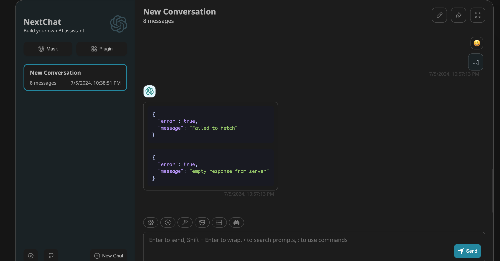
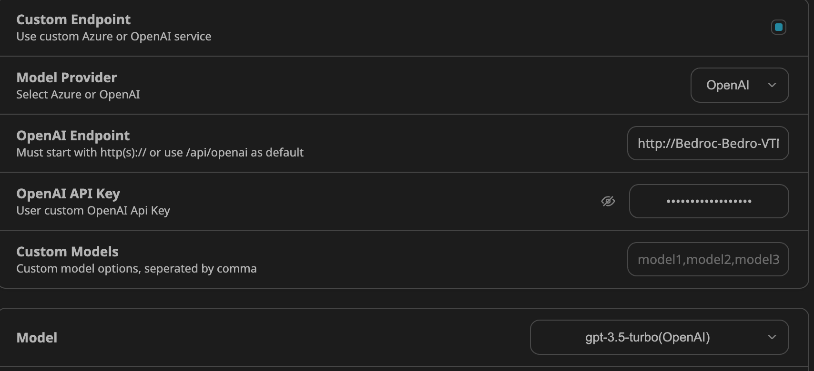


参考：[通过 Bedrock Access Gateway 解决方案快速访问 Amazon Bedrock 的多种大语言模型](https://aws.amazon.com/cn/blogs/china/quickly-access-multiple-llms-with-the-bedrock-access-gateway-solution/)


# 背景

Amazon Bedrock 服务支持一系列领先的基础模型，与 OpenAI 的 GPT-4 等模型相比，其中的 Claude3 在保持高性能水平的同时，还能为客户带来更低的使用成本。
目前市场上有很多可直接调用OpenAI的API使用生成式AI的client，但并不直接支持调用Amazon Bedrock API。
可以使用Bedrock Access Gateway（BAG）解决方案实现不更改应用代码的情况下，兼容OpenAI API代理，把OpenAI API的调用转发到 Bedrock。

# 方案架构


BAG 采用无服务器 （Serverless）架构

- Application Load Balancer（ALB）对外提供访问，由 Amazon Lambda 处理 API 请求，用户不需要登录或管理后台服务器。
- 通过修改 Lambda 的环境变量 DEFAULT_MODEL 来指定默认模型。
- Parameter Store 服务存储 API Key 参数，该参数的值用于 API 访问的认证。

# 方案实现

## 1. **创建自定义** API Key

> https://github.com/aws-samples/bedrock-access-gateway

1. Open the AWS Management Console and navigate to the Systems Manager service.
2. In the left-hand navigation pane, click on "Parameter Store".
3. Click on the "Create parameter" button.
4. In the "Create parameter" window, select the following options:
   - Name: Enter a descriptive name for your parameter (e.g., "BedrockProxyAPIKey").
   - Description: Optionally, provide a description for the parameter.
   - Tier: Select **Standard**.
   - Type: Select **SecureString**.
   - KMS key id： aws/ssm
   - Value: Any string (without spaces).
5. Click "Create parameter".
6. Make a note of the parameter name you used (e.g., "BedrockProxyAPIKey"). You'll need this in the next step.

## 2. **部署** Amazon CloudFormation 堆栈

部署后可生成ALB，Lambda

> https://console.aws.amazon.com/cloudformation/home#/stacks/create/template?stackName=BedrockProxyAPI&templateURL=https://aws-gcr-solutions.s3.amazonaws.com/bedrock-access-gateway/latest/BedrockProxy.template

一直next step，acknowledge全选


## 部署代码需要修改

- 公司账户不支持创建VPC和IGW
- 需要指定其他资源指向默认已存在的VPC、IGW

## 部署代码解析

```yaml
https://docs.aws.amazon.com/AWSCloudFormation/latest/UserGuide/template-anatomy.html

{	# 描述模板的文本字符串。此部分必须始终遵循模板格式版本部分。
  "Description": "Bedrock Access Gateway - OpenAI-compatible RESTful APIs for Amazon Bedrock",
  # 扩展了 CloudFormation 模板的功能，允许使用更多的内部函数和表达式。此处声明Transform为了用Fn::FindInMap函数，函数作用为从Mapping section中检索值
  "Transform": "AWS::LanguageExtensions",
  # 要在运行时（创建或更新堆栈时）传递给模板的值。您可以引用模板的 Resources 和 Outputs 部分中的参数。
  "Parameters": {
    "ApiKeyParam": {
      "Type": "String",
      "Default": "",
      "Description": "The parameter name in System Manager used to store the API Key, leave blank to use a default key"
    }
  },
  # 指定堆栈资源及其属性
  "Resources": {
    # 创建VPC
    "VPCB9E5F0B4": {
      "Type": "AWS::EC2::VPC",
      "Properties": {
        "CidrBlock": "10.250.0.0/16",
        "EnableDnsHostnames": true,
        "EnableDnsSupport": true,
        "InstanceTenancy": "default",
        "Tags": [
          {
            "Key": "Name",
            "Value": "BedrockProxy/VPC"
          }
        ]
      }
    },
    
    # 创建公共子网1
    "VPCPublicSubnet1SubnetB4246D30": {
      "Type": "AWS::EC2::Subnet",
      "Properties": {
        "AvailabilityZone": {"Fn::Select": [0, {"Fn::GetAZs": ""}]},
        "CidrBlock": "10.250.0.0/24",
        "MapPublicIpOnLaunch": true,
        "VpcId": {"Ref": "VPCB9E5F0B4"}
        # ... 其他属性 ...
      }
    },
    
    # 创建公共子网2
    "VPCPublicSubnet2Subnet74179F39": {
      "Type": "AWS::EC2::Subnet",
      "Properties": {
        "AvailabilityZone": {"Fn::Select": [1, {"Fn::GetAZs": ""}]},
        "CidrBlock": "10.250.1.0/24",
        "MapPublicIpOnLaunch": true,
        "VpcId": {"Ref": "VPCB9E5F0B4"}
        # ... 其他属性 ...
      }
    },
    
    # 创建互联网网关
    "VPCIGWB7E252D3": {
      "Type": "AWS::EC2::InternetGateway",
      "Properties": {
        "Tags": [
          {
            "Key": "Name",
            "Value": "BedrockProxy/VPC"
          }
        ]
      }
    },
    
    # 将互联网网关附加到VPC
    "VPCVPCGW99B986DC": {
      "Type": "AWS::EC2::VPCGatewayAttachment",
      "Properties": {
        "InternetGatewayId": {"Ref": "VPCIGWB7E252D3"},
        "VpcId": {"Ref": "VPCB9E5F0B4"}
      }
    },
    
    # 创建Lambda函数的IAM角色
    "ProxyApiHandlerServiceRoleBE71BFB1": {
      "Type": "AWS::IAM::Role",
      "Properties": {
        "AssumeRolePolicyDocument": {
          # ... 角色信任关系 ...
        },
        "ManagedPolicyArns": [
          # ... 附加的托管策略 ...
        ]
      }
    },
    
    # 为Lambda函数的IAM角色添加内联策略
    "ProxyApiHandlerServiceRoleDefaultPolicy86681202": {
      "Type": "AWS::IAM::Policy",
      "Properties": {
        "PolicyDocument": {
          # ... 策略文档，允许调用Bedrock和访问SSM参数 ...
        },
        "PolicyName": "ProxyApiHandlerServiceRoleDefaultPolicy86681202",
        "Roles": [{"Ref": "ProxyApiHandlerServiceRoleBE71BFB1"}]
      }
    },
    
    # 创建Lambda函数
    "ProxyApiHandlerEC15A492": {
      "Type": "AWS::Lambda::Function",
      "Properties": {
        "Architectures": ["arm64"],
        "Code": {
          "ImageUri": # ... Docker镜像URI ...
        },
        "Description": "Bedrock Proxy API Handler",
        "Environment": {
          "Variables": {
            # ... 环境变量 ...
          }
        },
        "MemorySize": 1024,
        "PackageType": "Image",
        "Role": {"Fn::GetAtt": ["ProxyApiHandlerServiceRoleBE71BFB1", "Arn"]},
        "Timeout": 300
      }
    },
    
    # 创建Application Load Balancer
    "ProxyALB87756780": {
      "Type": "AWS::ElasticLoadBalancingV2::LoadBalancer",
      "Properties": {
        "LoadBalancerAttributes": [
          {
            "Key": "deletion_protection.enabled",
            "Value": "false"
          }
        ],
        "Scheme": "internet-facing",
        "SecurityGroups": [{"Fn::GetAtt": ["ProxyALBSecurityGroup0D6CA3DA", "GroupId"]}],
        "Subnets": [
          {"Ref": "VPCPublicSubnet1SubnetB4246D30"},
          {"Ref": "VPCPublicSubnet2Subnet74179F39"}
        ],
        "Type": "application"
      }
    },
    
    # 创建ALB的安全组
    "ProxyALBSecurityGroup0D6CA3DA": {
      "Type": "AWS::EC2::SecurityGroup",
      "Properties": {
        "GroupDescription": "Automatically created Security Group for ELB BedrockProxyALB1CE4CAD1",
        "SecurityGroupEgress": [# ... 出站规则 ...],
        "SecurityGroupIngress": [# ... 入站规则，允许80端口 ...],
        "VpcId": {"Ref": "VPCB9E5F0B4"}
      }
    },
    
    # 创建ALB监听器
    "ProxyALBListener933E9515": {
      "Type": "AWS::ElasticLoadBalancingV2::Listener",
      "Properties": {
        "DefaultActions": [
          {
            "TargetGroupArn": {"Ref": "ProxyALBListenerTargetsGroup187739FA"},
            "Type": "forward"
          }
        ],
        "LoadBalancerArn": {"Ref": "ProxyALB87756780"},
        "Port": 80,
        "Protocol": "HTTP"
      }
    },
    
    # 创建ALB目标组
    "ProxyALBListenerTargetsGroup187739FA": {
      "Type": "AWS::ElasticLoadBalancingV2::TargetGroup",
      "Properties": {
        "HealthCheckEnabled": false,
        "TargetType": "lambda",
        "Targets": [
          {
            "Id": {"Fn::GetAtt": ["ProxyApiHandlerEC15A492", "Arn"]}
          }
        ]
      }
    }
  },
  
  # 区域映射表，用于设置不同区域的默认模型
  "Mappings": {
    "ProxyRegionTable03E5BEB3": {
      # ... 区域到模型的映射 ...
    }
  },
  
  # 输出API基础URL
  "Outputs": {
    "APIBaseUrl": {
      "Description": "Proxy API Base URL (OPENAI_API_BASE)",
      "Value": {
        "Fn::Join": ["", [
          "http://",
          {"Fn::GetAtt": ["ProxyALB87756780", "DNSName"]},
          "/api/v1"
        ]]
      }
    }
  }
}
```

这个模板主要做了以下几件事：

1. 创建了一个VPC和两个公共子网。
2. 设置了互联网网关和路由表。
3. 创建了一个Lambda函数来处理API请求。
4. 为Lambda函数设置了必要的IAM角色和权限。
5. 创建了一个Application Load Balancer (ALB)来路由请求到Lambda函数。
6. 设置了安全组来控制对ALB的访问。
7. 创建了ALB监听器和目标组，将请求转发到Lambda函数。
8. 使用区域映射来为不同的AWS区域设置不同的默认Bedrock模型。
9. 输出API的基础URL，这可以用作OpenAI API的基础URL。

总的来说，这个模板创建了一个基于Lambda和ALB的无服务器API网关，用于代理对Amazon Bedrock服务的请求，并提供了与OpenAI API兼容的接口。

## 2.1 修改后的cloudformation template

```json
{
  "Description": "Bedrock Access Gateway - OpenAI-compatible RESTful APIs for Amazon Bedrock",
  "Parameters": {
    "ApiKeyParam": {
      "Type": "String",
      "Default": "BedrockProxyAPIKe",
      "Description": "The parameter name in System Manager used to store the API Key, leave blank to use a default key"
    },
    "ExistingVpcId": {
      "Type": "AWS::EC2::VPC::Id",
      "Default": "vpc-08f77b07c34029b7a",
      "Description": "ID of an existing VPC"
    },
    "ExistingVpcIgwID": {
      "Type": "String",
      "Default": "igw-0edd3612557ae42b4",
      "Description": "ID of the existing Internet Gateway"
    }
  },
  "Resources": {
    "BedrockVPCPublicSubnet1SubnetB4246D30": {
      "Type": "AWS::EC2::Subnet",
      "Properties": {
        "AvailabilityZone": {
          "Fn::Select": [
            0,
            {
              "Fn::GetAZs": ""
            }
          ]
        },
        "CidrBlock": "10.10.2.0/28",
        "MapPublicIpOnLaunch": true,
        "Tags": [
          {
            "Key": "aws-cdk:subnet-name",
            "Value": "Public"
          },
          {
            "Key": "aws-cdk:subnet-type",
            "Value": "Public"
          },
          {
            "Key": "Name",
            "Value": "BedrockProxy/VPC/PublicSubnet1"
          }
        ],
        "VpcId": {
          "Ref": "ExistingVpcId"
        }
      },
      "Metadata": {
        "aws:cdk:path": "BedrockProxy/VPC/PublicSubnet1/Subnet"
      }
    },
    "BedrockVPCPublicSubnet1RouteTableFEE4B781": {
      "Type": "AWS::EC2::RouteTable",
      "Properties": {
        "Tags": [
          {
            "Key": "Name",
            "Value": "BedrockProxy/VPC/PublicSubnet1"
          }
        ],
        "VpcId": {
          "Ref": "ExistingVpcId"
        }
      },
      "Metadata": {
        "aws:cdk:path": "BedrockProxy/VPC/PublicSubnet1/RouteTable"
      }
    },
    "BedrockVPCPublicSubnet1RouteTableAssociation0B0896DC": {
      "Type": "AWS::EC2::SubnetRouteTableAssociation",
      "Properties": {
        "RouteTableId": {
          "Ref": "BedrockVPCPublicSubnet1RouteTableFEE4B781"
        },
        "SubnetId": {
          "Ref": "BedrockVPCPublicSubnet1SubnetB4246D30"
        }
      },
      "Metadata": {
        "aws:cdk:path": "BedrockProxy/VPC/PublicSubnet1/RouteTableAssociation"
      }
    },
    "BedrockVPCPublicSubnet1DefaultRoute91CEF279": {
      "Type": "AWS::EC2::Route",
      "Properties": {
        "DestinationCidrBlock": "0.0.0.0/0",
        "GatewayId": {
          "Ref": "ExistingVpcIgwID"
        },
        "RouteTableId": {
          "Ref": "BedrockVPCPublicSubnet1RouteTableFEE4B781"
        }
      },
      "Metadata": {
        "aws:cdk:path": "BedrockProxy/VPC/PublicSubnet1/DefaultRoute"
      }
    },
    "BedrockVPCPublicSubnet2Subnet74179F39": {
      "Type": "AWS::EC2::Subnet",
      "Properties": {
        "AvailabilityZone": {
          "Fn::Select": [
            1,
            {
              "Fn::GetAZs": ""
            }
          ]
        },
        "CidrBlock": "10.10.3.0/28",
        "MapPublicIpOnLaunch": true,
        "Tags": [
          {
            "Key": "aws-cdk:subnet-name",
            "Value": "Public"
          },
          {
            "Key": "aws-cdk:subnet-type",
            "Value": "Public"
          },
          {
            "Key": "Name",
            "Value": "BedrockProxy/VPC/PublicSubnet2"
          }
        ],
        "VpcId": {
          "Ref": "ExistingVpcId"
        }
      },
      "Metadata": {
        "aws:cdk:path": "BedrockProxy/VPC/PublicSubnet2/Subnet"
      }
    },
    "BedrockVPCPublicSubnet2RouteTable6F1A15F1": {
      "Type": "AWS::EC2::RouteTable",
      "Properties": {
        "Tags": [
          {
            "Key": "Name",
            "Value": "BedrockProxy/VPC/PublicSubnet2"
          }
        ],
        "VpcId": {
          "Ref": "ExistingVpcId"
        }
      },
      "Metadata": {
        "aws:cdk:path": "BedrockProxy/VPC/PublicSubnet2/RouteTable"
      }
    },
    "BedrockVPCPublicSubnet2RouteTableAssociation5A808732": {
      "Type": "AWS::EC2::SubnetRouteTableAssociation",
      "Properties": {
        "RouteTableId": {
          "Ref": "BedrockVPCPublicSubnet2RouteTable6F1A15F1"
        },
        "SubnetId": {
          "Ref": "BedrockVPCPublicSubnet2Subnet74179F39"
        }
      },
      "Metadata": {
        "aws:cdk:path": "BedrockProxy/VPC/PublicSubnet2/RouteTableAssociation"
      }
    },
    "BedrockVPCPublicSubnet2DefaultRouteB7481BBA": {
      "Type": "AWS::EC2::Route",
      "Properties": {
        "DestinationCidrBlock": "0.0.0.0/0",
        "GatewayId": {
          "Ref": "ExistingVpcIgwID"
        },
        "RouteTableId": {
          "Ref": "BedrockVPCPublicSubnet2RouteTable6F1A15F1"
        }
      },
      "Metadata": {
        "aws:cdk:path": "BedrockProxy/VPC/PublicSubnet2/DefaultRoute"
      }
    },
    "BedrockBedrockProxyApiHandlerServiceRoleBE71BFB1": {
      "Type": "AWS::IAM::Role",
      "Properties": {
        "AssumeRolePolicyDocument": {
          "Statement": [
            {
              "Action": "sts:AssumeRole",
              "Effect": "Allow",
              "Principal": {
                "Service": "lambda.amazonaws.com"
              }
            }
          ],
          "Version": "2012-10-17"
        },
        "ManagedPolicyArns": [
          {
            "Fn::Join": [
              "",
              [
                "arn:",
                {
                  "Ref": "AWS::Partition"
                },
                ":iam::aws:policy/service-role/AWSLambdaBasicExecutionRole"
              ]
            ]
          }
        ]
      },
      "Metadata": {
        "aws:cdk:path": "BedrockProxy/Proxy/ApiHandler/ServiceRole/Resource"
      }
    },
    "BedrockProxyApiHandlerServiceRoleDefaultPolicy86681202": {
      "Type": "AWS::IAM::Policy",
      "Properties": {
        "PolicyDocument": {
          "Statement": [
            {
              "Action": [
                "bedrock:InvokeModel",
                "bedrock:InvokeModelWithResponseStream"
              ],
              "Effect": "Allow",
              "Resource": "arn:aws:bedrock:*::foundation-model/*"
            },
            {
              "Action": [
                "ssm:DescribeParameters",
                "ssm:GetParameters",
                "ssm:GetParameter",
                "ssm:GetParameterHistory"
              ],
              "Effect": "Allow",
              "Resource": {
                "Fn::Join": [
                  "",
                  [
                    "arn:",
                    {
                      "Ref": "AWS::Partition"
                    },
                    ":ssm:",
                    {
                      "Ref": "AWS::Region"
                    },
                    ":",
                    {
                      "Ref": "AWS::AccountId"
                    },
                    ":parameter/",
                    {
                      "Ref": "ApiKeyParam"
                    }
                  ]
                ]
              }
            }
          ],
          "Version": "2012-10-17"
        },
        "PolicyName": "BedrockProxyApiHandlerServiceRoleDefaultPolicy86681202",
        "Roles": [
          {
            "Ref": "BedrockBedrockProxyApiHandlerServiceRoleBE71BFB1"
          }
        ]
      },
      "Metadata": {
        "aws:cdk:path": "BedrockProxy/Proxy/ApiHandler/ServiceRole/DefaultPolicy/Resource"
      }
    },
    "BedrockProxyApiHandlerEC15A492": {
      "Type": "AWS::Lambda::Function",
      "Properties": {
        "Architectures": [
          "arm64"
        ],
        "Code": {
          "ImageUri": {
            "Fn::Join": [
              "",
              [
                "366590864501.dkr.ecr.",
                {
                  "Ref": "AWS::Region"
                },
                ".",
                {
                  "Ref": "AWS::URLSuffix"
                },
                "/bedrock-proxy-api:latest"
              ]
            ]
          }
        },
        "Description": "Bedrock Proxy API Handler",
        "Environment": {
          "Variables": {
            "API_KEY_PARAM_NAME": {
              "Ref": "ApiKeyParam"
            },
            "DEBUG": "false",
            "DEFAULT_MODEL": {
              "Fn::FindInMap": [
                "ProxyRegionTable03E5BEB3",
                {
                  "Ref": "AWS::Region"
                },
                "model",
                {
                  "DefaultValue": "anthropic.claude-3-5-sonnet-20240620-v1:0"
                }
              ]
            },
            "DEFAULT_EMBEDDING_MODEL": "cohere.embed-multilingual-v3"
          }
        },
        "MemorySize": 1024,
        "PackageType": "Image",
        "Role": {
          "Fn::GetAtt": [
            "BedrockBedrockProxyApiHandlerServiceRoleBE71BFB1",
            "Arn"
          ]
        },
        "Timeout": 300
      },
      "DependsOn": [
        "BedrockProxyApiHandlerServiceRoleDefaultPolicy86681202",
        "BedrockBedrockProxyApiHandlerServiceRoleBE71BFB1"
      ],
      "Metadata": {
        "aws:cdk:path": "BedrockProxy/Proxy/ApiHandler/Resource"
      }
    },
    "BedrockProxyApiHandlerInvoke2UTWxhlfyqbT5FTn5jvgbLgjFfJwzswGk55DU1HYF6C33779": {
      "Type": "AWS::Lambda::Permission",
      "Properties": {
        "Action": "lambda:InvokeFunction",
        "FunctionName": {
          "Fn::GetAtt": [
            "BedrockProxyApiHandlerEC15A492",
            "Arn"
          ]
        },
        "Principal": "elasticloadbalancing.amazonaws.com"
      },
      "Metadata": {
        "aws:cdk:path": "BedrockProxy/Proxy/ApiHandler/Invoke2UTWxhlfyqbT5FTn--5jvgbLgj+FfJwzswGk55DU1H--Y="
      }
    },
    "BedrockProxyALB87756780": {
      "Type": "AWS::ElasticLoadBalancingV2::LoadBalancer",
      "Properties": {
        "LoadBalancerAttributes": [
          {
            "Key": "deletion_protection.enabled",
            "Value": "false"
          }
        ],
        "Scheme": "internet-facing",
        "SecurityGroups": [
          {
            "Fn::GetAtt": [
              "BedrockProxyALBSecurityGroup0D6CA3DA",
              "GroupId"
            ]
          }
        ],
        "Subnets": [
          {
            "Ref": "BedrockVPCPublicSubnet1SubnetB4246D30"
          },
          {
            "Ref": "BedrockVPCPublicSubnet2Subnet74179F39"
          }
        ],
        "Type": "application"
      },
      "DependsOn": [
        "BedrockVPCPublicSubnet1DefaultRoute91CEF279",
        "BedrockVPCPublicSubnet1RouteTableAssociation0B0896DC",
        "BedrockVPCPublicSubnet2DefaultRouteB7481BBA",
        "BedrockVPCPublicSubnet2RouteTableAssociation5A808732"
      ],
      "Metadata": {
        "aws:cdk:path": "BedrockProxy/Proxy/ALB/Resource"
      }
    },
    "BedrockProxyALBSecurityGroup0D6CA3DA": {
      "Type": "AWS::EC2::SecurityGroup",
      "Properties": {
        "GroupDescription": "Automatically created Security Group for ELB BedrockProxyALB1CE4CAD1",
        "SecurityGroupEgress": [
          {
            "CidrIp": "255.255.255.255/32",
            "Description": "Disallow all traffic",
            "FromPort": 252,
            "IpProtocol": "icmp",
            "ToPort": 86
          }
        ],
        "SecurityGroupIngress": [
          {
            "CidrIp": "0.0.0.0/0",
            "Description": "Allow from anyone on port 80",
            "FromPort": 80,
            "IpProtocol": "tcp",
            "ToPort": 80
          }
        ],
        "VpcId": {
          "Ref": "ExistingVpcId"
        }
      },
      "Metadata": {
        "aws:cdk:path": "BedrockProxy/Proxy/ALB/SecurityGroup/Resource"
      }
    },
    "BedrockProxyALBListener933E9515": {
      "Type": "AWS::ElasticLoadBalancingV2::Listener",
      "Properties": {
        "DefaultActions": [
          {
            "TargetGroupArn": {
              "Ref": "BedrockProxyALBListenerTargetsGroup187739FA"
            },
            "Type": "forward"
          }
        ],
        "LoadBalancerArn": {
          "Ref": "BedrockProxyALB87756780"
        },
        "Port": 80,
        "Protocol": "HTTP"
      },
      "Metadata": {
        "aws:cdk:path": "BedrockProxy/Proxy/ALB/Listener/Resource"
      }
    },
    "BedrockProxyALBListenerTargetsGroup187739FA": {
      "Type": "AWS::ElasticLoadBalancingV2::TargetGroup",
      "Properties": {
        "HealthCheckEnabled": false,
        "TargetType": "lambda",
        "Targets": [
          {
            "Id": {
              "Fn::GetAtt": [
                "BedrockProxyApiHandlerEC15A492",
                "Arn"
              ]
            }
          }
        ]
      },
      "DependsOn": [
        "BedrockProxyApiHandlerInvoke2UTWxhlfyqbT5FTn5jvgbLgjFfJwzswGk55DU1HYF6C33779"
      ],
      "Metadata": {
        "aws:cdk:path": "BedrockProxy/Proxy/ALB/Listener/TargetsGroup/Resource"
      }
    },
    "CDKMetadata": {
      "Type": "AWS::CDK::Metadata",
      "Properties": {
        "Analytics": "v2:deflate64:H4sIAAAAAAAA/1VRXW/CMAz8LbyHDMovAKZNSJtWFcTr5LpeZ0iTKHFAqOp/n1q+uief7y7ynZLp+WKhZxM4xylWx6nhUrdbATyq9Y/NIUBDQkHBOX63hJlu9x57aZ+vVZ5Kw7hNpSXpuScqXBLaQWnoyT+5ZYwOGYSdfZh7sLFCwZK8g9AZLrczt20pAvjbkBW1JUyB5fIeXPLDgTHRKcKgC/IusrhwWUEkZaApK9Dtq8MjhU0DNb0li/cIY5xTaDhGdrZTDI1uC3etMczcGcYh2hV1igxEYTQOqhIMWGRbnzLdLr03jEPLDwfVatAo9E//7WMfRyF789zxSN9BqEketUdr16mCoksBh6if4D3buodfSXy6fsrIsHa2Yhk6WleRPsSXUzbT87meTQ6ReRqSFW5IF9f5B/Z2H8goAgAA"
      },
      "Metadata": {
        "aws:cdk:path": "BedrockProxy/CDKMetadata/Default"
      },
      "Condition": "CDKMetadataAvailable"
    }
  },
  "Mappings": {
    "ProxyRegionTable03E5BEB3": {
      "us-east-1": {
        "model": "anthropic.claude-3-5-sonnet-20240620-v1:0"
      },
      "ap-southeast-1": {
        "model": "anthropic.claude-v2"
      },
      "ap-northeast-1": {
        "model": "anthropic.claude-v2:1"
      },
      "eu-central-1": {
        "model": "anthropic.claude-v2:1"
      }
    }
  },
  "Outputs": {
    "APIBaseUrl": {
      "Description": "Proxy API Base URL (OPENAI_API_BASE)",
      "Value": {
        "Fn::Join": [
          "",
          [
            "http://",
            {
              "Fn::GetAtt": [
                "BedrockProxyALB87756780",
                "DNSName"
              ]
            },
            "/api/v1"
          ]
        ]
      }
    }
  },
  "Conditions": {
    "CDKMetadataAvailable": {
      "Fn::Or": [
        {
          "Fn::Or": [
            {
              "Fn::Equals": [
                {
                  "Ref": "AWS::Region"
                },
                "af-south-1"
              ]
            },
            {
              "Fn::Equals": [
                {
                  "Ref": "AWS::Region"
                },
                "ap-east-1"
              ]
            },
            {
              "Fn::Equals": [
                {
                  "Ref": "AWS::Region"
                },
                "ap-northeast-1"
              ]
            },
            {
              "Fn::Equals": [
                {
                  "Ref": "AWS::Region"
                },
                "ap-northeast-2"
              ]
            },
            {
              "Fn::Equals": [
                {
                  "Ref": "AWS::Region"
                },
                "ap-south-1"
              ]
            },
            {
              "Fn::Equals": [
                {
                  "Ref": "AWS::Region"
                },
                "ap-southeast-1"
              ]
            },
            {
              "Fn::Equals": [
                {
                  "Ref": "AWS::Region"
                },
                "ap-southeast-2"
              ]
            },
            {
              "Fn::Equals": [
                {
                  "Ref": "AWS::Region"
                },
                "ca-central-1"
              ]
            },
            {
              "Fn::Equals": [
                {
                  "Ref": "AWS::Region"
                },
                "cn-north-1"
              ]
            },
            {
              "Fn::Equals": [
                {
                  "Ref": "AWS::Region"
                },
                "cn-northwest-1"
              ]
            }
          ]
        },
        {
          "Fn::Or": [
            {
              "Fn::Equals": [
                {
                  "Ref": "AWS::Region"
                },
                "eu-central-1"
              ]
            },
            {
              "Fn::Equals": [
                {
                  "Ref": "AWS::Region"
                },
                "eu-north-1"
              ]
            },
            {
              "Fn::Equals": [
                {
                  "Ref": "AWS::Region"
                },
                "eu-south-1"
              ]
            },
            {
              "Fn::Equals": [
                {
                  "Ref": "AWS::Region"
                },
                "eu-west-1"
              ]
            },
            {
              "Fn::Equals": [
                {
                  "Ref": "AWS::Region"
                },
                "eu-west-2"
              ]
            },
            {
              "Fn::Equals": [
                {
                  "Ref": "AWS::Region"
                },
                "eu-west-3"
              ]
            },
            {
              "Fn::Equals": [
                {
                  "Ref": "AWS::Region"
                },
                "il-central-1"
              ]
            },
            {
              "Fn::Equals": [
                {
                  "Ref": "AWS::Region"
                },
                "me-central-1"
              ]
            },
            {
              "Fn::Equals": [
                {
                  "Ref": "AWS::Region"
                },
                "me-south-1"
              ]
            },
            {
              "Fn::Equals": [
                {
                  "Ref": "AWS::Region"
                },
                "sa-east-1"
              ]
            }
          ]
        },
        {
          "Fn::Or": [
            {
              "Fn::Equals": [
                {
                  "Ref": "AWS::Region"
                },
                "us-east-1"
              ]
            },
            {
              "Fn::Equals": [
                {
                  "Ref": "AWS::Region"
                },
                "us-east-2"
              ]
            },
            {
              "Fn::Equals": [
                {
                  "Ref": "AWS::Region"
                },
                "us-west-1"
              ]
            },
            {
              "Fn::Equals": [
                {
                  "Ref": "AWS::Region"
                },
                "us-west-2"
              ]
            }
          ]
        }
      ]
    }
  }
}
```

与原模版相比，变更点如下：

- 删除"Transform": "AWS::LanguageExtensions", 引发error，删除后部署未见异常
- 添加parameter：ExistingVpcId，ExistingVpcIgwID，绕开公司禁止创建resource的规则，部署模版中引用vpc、igw的部分全部用parameter替换
- 删除创建vpc、igw资源的代码
- 子网cidr根据公司aws创建规则进行填写
- 创建资源名的前缀全部添加Bedrock用来与公司内部其他资源区分
- 使用的VPC、IGW的attach已经建立，删除创建代码已经depend on的部分


## 3. 部署后测试结果

```shell
export OPENAI_API_KEY=<API Key参数的值> 
export OPENAI_BASE_URL=<API Base URL>
curl $OPENAI_BASE_URL/chat/completions \
  -H "Content-Type: application/json" \
  -H "Authorization: Bearer $OPENAI_API_KEY" \
  -d '{
    "model": "anthropic.claude-v2:1",
    "messages": [
      {
        "role": "user",
        "content": "what is your version now"
      }
    ]
  }'


{"id":"chatcmpl-e90fc9f4","created":1720027425,"model":"anthropic.claude-v2:1","system_fingerprint":"fp","choices":[{"index":0,"finish_reason":"stop","logprobs":null,"message":{"role":"assistant","content":"I'm Claude, an AI assistant created by Anthropic."}}],"object":"chat.completion","usage":{"prompt_tokens":14,"completion_tokens":17,"total_tokens":31}}% 
```

注意：

- 模型model id必须与aws region中model access中一致，才能返回结果

- aws region取决于部署lambda所在区域，公司aws位于ap-northeast-1,就最高级别只能用anthropic.claude-v2:1

# 4.在 NextChat 应用程序中使用

NextChat是社区中比较流行的前端gpt应用。我们部署得到了url和api key，经过简单配置就可以使用 NextChat 轻松访问Claude 以及其他 Amazon Bedrock 上支持的大语言模型。

🚧 测试失败，原因未知。





一直试图寻找一个client能直接调用bedrock claude3的方法，此方法只能在命令行调用2.1版本（因为lambda部署在tokyo区域，没有最新版本），客户端调用失败。
Amazon自家也有开源用的mac客户端（https://github.com/aws-samples/amazon-bedrock-client-for-mac/releases）用于调用bedrock，但是打开失败。。。

### TODO：

更新macos后再试一下bedrock mac 客户端能不能用。

# 总结

Bedrock Access Gateway（BAG）解决方案提供了OpenAI 的代理功能，帮助用户利用aws url 和 api 模拟OpenAI url 和 api，但该方案目前本人只实现了命令行调用bedrock中的基础模型，客户端调用失败；且只能用所在区域model access list里面的模型，东京截止到202040705只能用claude2.1。
目前还是没有调用aws bedrock内置模型的好方案。
