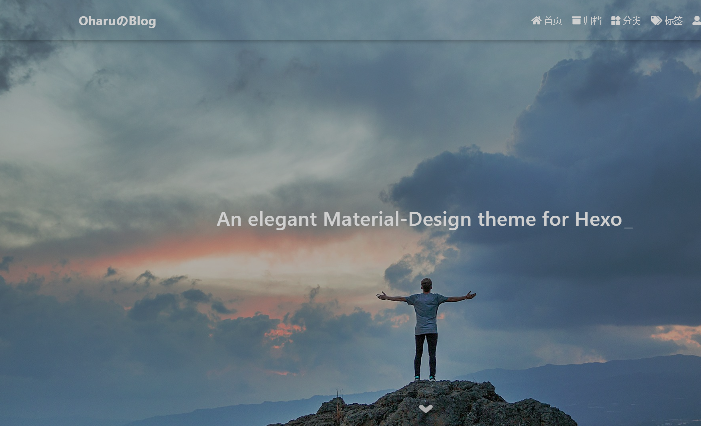
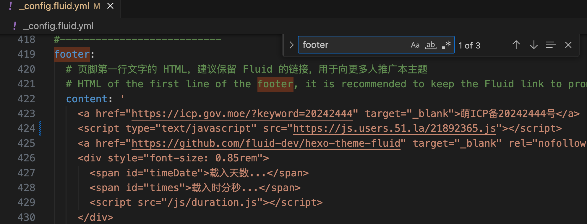
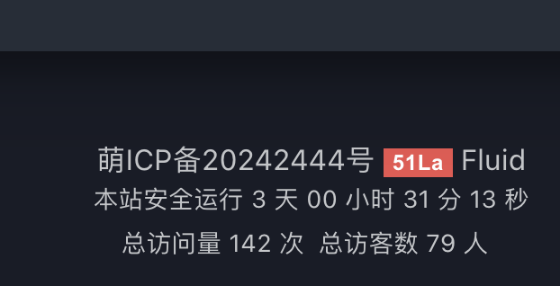
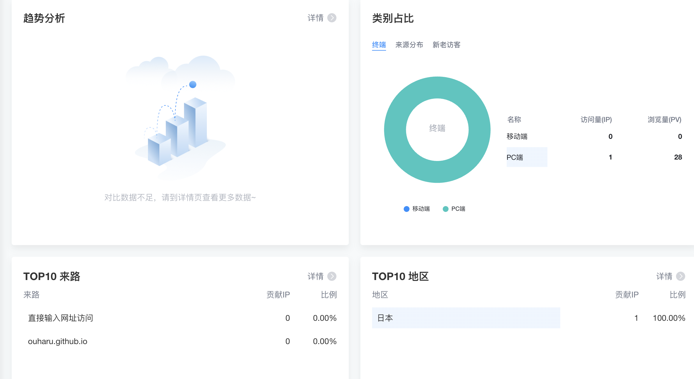
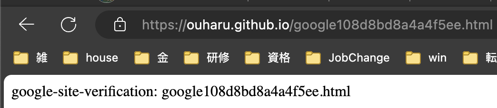
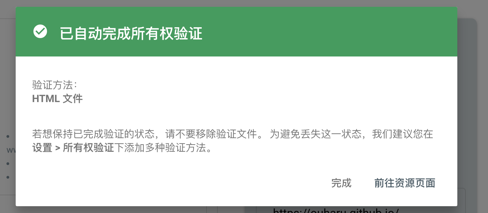
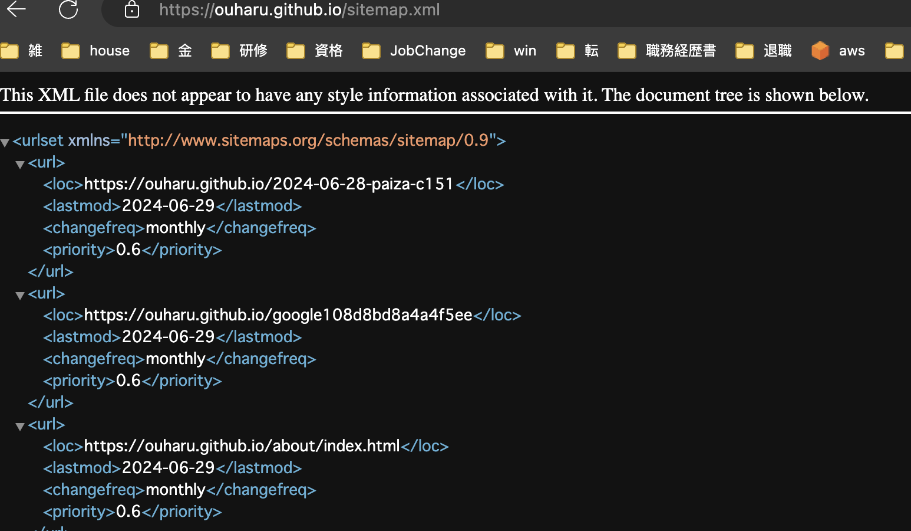
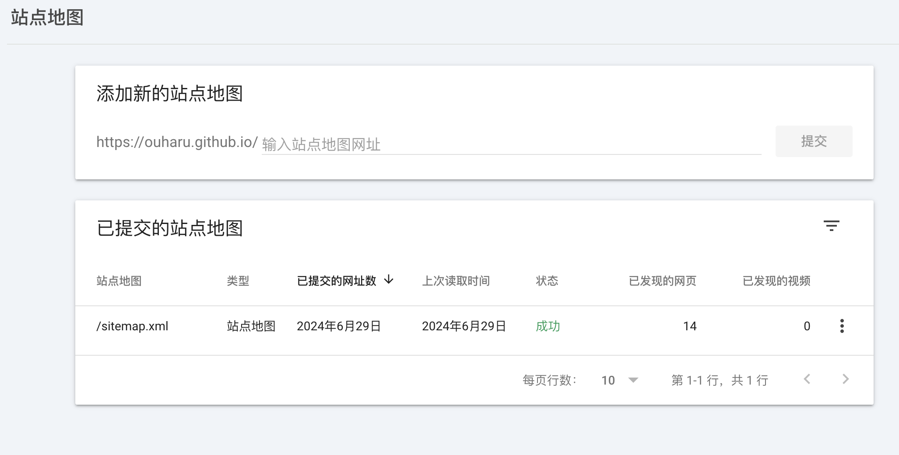

参考： <https://hexo.fluid-dev.com/docs/guide/>

# 1. fluid主题安装

命令行输入：

```powershell
PS C:\Users> npm install --save hexo-theme-fluid

added 1 package, and audited 229 packages in 14s

23 packages are looking for funding
  run `npm fund` for details

found 0 vulnerabilities
```

博客目录下创建 `_config.fluid.yml`，将主题的 [_config.yml](https://github.com/fluid-dev/hexo-theme-fluid/blob/master/_config.yml)内容复制过去。

# 2. 指定主题

如下修改 Hexo 博客目录中的 `_config.yml`：

```yaml
theme: fluid  # 指定主题

language: zh-CN  # 指定语言，会影响主题显示的语言，按需修改
```

# 3. 创建「关于页」

首次使用主题的「关于页」需要手动创建：

```bash
hexo new page about
```

创建成功后修改 `/source/about/index.md`，添加 `layout` 属性。

修改后的文件示例如下：

```yaml
---
title: 标题
layout: about
---

这里写关于页的正文，支持 Markdown, HTML
```

*此设置为了显示头像

# 4.启用主题

```powershell
hexo clean
hexo g
hexo s
```

# 5.页面顶部大图设置

```powershell
  # 首页 Banner 头图，可以是相对路径或绝对路径，以下相同
  # 实际图片对应存放在 /source/img/bg/xxx.jpg
  # 修改主题配置文件 _config.fluid.yml
  # Path of Banner image, can be a relative path or an absolute path, the same on other pages
  banner_img: /img/bg/joshua-earle-9idqIGrLuTE-unsplash.jpg

```

# 6. 博客标题

页面左上角的博客标题，可在**主题配置**中设置：

```yaml
navbar:
  blog_title: oharuのblog
```



# 7. 网页统计

目前支持多种统计网站，开启后按需填入 Key 或 ID 即可。

```yaml
  # Google Analytics 4 的媒体资源 ID
  # Google Analytics 4 MEASUREMENT_ID
  # See: https://support.google.com/analytics/answer/9744165#zippy=%2Cin-this-article
  google:
    measurement_id: G-8Q835Q3Z38
```

# 8. 展示 PV 与 UV 统计

页脚可以展示 PV 与 UV 统计数据，目前支持两种数据来源：[不蒜子](http://busuanzi.ibruce.info/)。

```yaml
statistics:
    enable: true
```

# 9. Slogan副标题设置

```yaml
  # 首页副标题的独立设置
  # Independent config of home page subtitle
  slogan:
    enable: true

    # 为空则按 hexo config.subtitle 显示
    # If empty, text based on `subtitle` in hexo config
    text: "An elegant Material-Design theme for Hexo"

    # 通过 API 接口作为首页副标题的内容，必须返回的是 JSON 格式，如果请求失败则按 text 字段显示，该功能必须先开启 typing 打字机功能
    # Subtitle of the homepage through the API, must be returned a JSON. If the request fails, it will be displayed in `text` value. This feature must first enable the typing animation
    api:
      enable: true

      # 请求地址
      # Request url
      url: "https://international.v1.hitokoto.cn/"

      # 请求方法
      # Request method
      # Available: GET | POST | PUT
      method: "GET"

      # 请求头
      # Request headers
      headers: {}

      # 从请求结果获取字符串的取值字段，最终必须是一个字符串，例如返回结果为 {"data": {"author": "fluid", "content": "An elegant theme"}}, 则取值字段为 ['data', 'content']；如果返回是列表则自动选择第一项
      # The value field of the string obtained from the response. For example, the response content is {"data": {"author": "fluid", "content": "An elegant theme"}}, the expected `keys: ['data','content']`; if the return is a list, the first item is automatically selected
      keys: ["hitokoto"]

# 一些好玩的功能
# Some fun features
fun_features:
  # 为 subtitle 添加打字机效果
  # Typing animation for subtitle
  typing:
    enable: true

    # 打印速度，数字越大越慢
    # Typing speed, the larger the number, the slower
    typeSpeed: 120

    # 游标字符
    # Cursor character
    cursorChar: "|"

    # 是否循环播放效果
    # If true, loop animation
    loop: true

    # 在指定页面开启，不填则在所有页面开启
    # Enable in specified page, all pages by default
    # Options: home | post | tag | category | about | links | page | 404
    scope: []

```

# 10.文章跳转方式

```yaml
  # 打开文章的标签方式
  # The browser tag to open the post
  # Available: _blank | _self
  post_url_target: _blank
```

# 【TODO】11.文章排序

如果想手动将某些文章固定在首页靠前的位置，可以在安装 `hexo-generator-index` >= 2.0.0 版本的情况下，在文章开头 [front-matter](https://hexo.io/zh-cn/docs/front-matter)中配置 `sticky` 属性：

```yaml
---
title: 文章标题
index_img: /img/example.jpg
date: 2019-10-10 10:00:00
sticky: 100
---
以下是文章内容
```

`sticky` 数值越大，该文章越靠前，达到类似于置顶的效果，其他未设置的文章依然按默认排序。

当文章设置了 `sticky` 后，主题会默认在首页文章标题前增加一个图标，来标识这是一个置顶文章，你可以通过**主题配置**去关闭或修改这个功能：

```yaml
index:
  post_sticky:
    enable: true
    icon: 'iconfont icon-top'
```

`icon` 可以通过[自定义图标](https://hexo.fluid-dev.com/docs/icon/)修改为其他图标

# 【TODO】12.文章在首页的封面图

对于单篇文章，在文章开头 [front-matter (opens new window)](https://hexo.io/zh-cn/docs/front-matter)中配置 `index_img` 属性。

```yaml
---
title: 文章标题
tags: [Hexo, Fluid]
index_img: /img/example.jpg
date: 2019-10-10 10:00:00
---
以下是文章内容
```

和 Banner 配置相同，`/img/example.jpg` 对应的是存放在 `/source/img/example.jpg` 目录下的图片（目录也可自定义，但必须在 source 目录下）。

# 13. 开启评论

选用[Giscus](https://giscus.app/zh-CN)，基于 GitHub Discussions，类似于 Utterances仓库

选择 giscus 连接到的仓库。请确保：

1. **该仓库是[公开的](https://docs.github.com/en/github/administering-a-repository/managing-repository-settings/setting-repository-visibility#making-a-repository-public)**，否则访客将无法查看 discussion。
2. **[giscus](https://github.com/apps/giscus) app 已安装**，否则访客将无法评论和回应。
3. **Discussions** 功能已[在你的仓库中启用](https://docs.github.com/en/github/administering-a-repository/managing-repository-settings/enabling-or-disabling-github-discussions-for-a-repository)。

仓库：ouharu/ouharu.github.io
成功！该仓库满足所有条件。
生成配置js：

```javascript
<script src="https://giscus.app/client.js"
        data-repo="ouharu/ouharu.github.io"
        data-repo-id="R_kgDOMNjsdg"
        data-category="Show and tell"
        data-category-id="DIC_kwDOMNjsds4CgbbR"
        data-mapping="pathname"
        data-strict="0"
        data-reactions-enabled="1"
        data-emit-metadata="1"
        data-input-position="top"
        data-theme="dark"
        data-lang="zh-CN"
        data-loading="lazy"
        crossorigin="anonymous"
        async>
</script>
```

```yaml
# Giscus
# 基于 GitHub Discussions，类似于 Utterances
# Based on GitHub Discussions, similar to Utterances
# See: https://giscus.app/
giscus:
  repo: ouharu/ouharu.github.io
  repo-id: R_kgDOMNjsdg
  category: Show and tell
  category-id: DIC_kwDOMNjsds4CgbbR
  theme-light: light
  theme-dark: dark
  mapping: pathname
  reactions-enabled: 1
  emit-metadata: 1
  input-position: top
  lang: zh-CN

```

# 14. 脚注

```yaml
  # 脚注语法，会在文章底部生成脚注，如果 Markdown 渲染器本身支持，则建议关闭，否则可能会冲突
  # Support footnote syntax, footnotes will be generated at the bottom of the post page. If the Markdown renderer itself supports it, please disable it, otherwise it may conflict
  footnote:
    enable: true
    # 脚注的节标题，也可以在 front-matter 中通过 `footnote: <h2>Reference</h2>` 这种形式修改单独页面的 header
    # The section title of the footnote, you can also modify the header of a single page in the form of `footnote: <h2>Reference</h2>` in front-matter
    header: '<h2>参考</h2>'
```

```markdown
正文

## 参考
[^1]: 参考资料1
[^2]: 参考资料2 
```

# 15. 友链

```yaml
# 友链的成员项
  # Member item of page
  items:
    - {
      title: "Fluid Blog",
      intro: "主题博客",
      link: "https://hexo.fluid-dev.com/",
      avatar: "/img/favicon.png"
    }
    - {
      title: "Fluid Repo",
      intro: "主题 GitHub 仓库",
      link: "https://github.com/fluid-dev/hexo-theme-fluid",
      avatar: "/img/favicon.png"
    }
    - {
      title: "小豹子的网络记事本",
      intro: "DBA/Oracle/Zabbix",
      link: "https://www.cnblogs.com/ddzj01",
      avatar: "https://www.cnblogs.com/images/cnblogs_com/ddzj01/1525954/t_20180512144908.png"
    }
    - {
      title: "大江小浪",
      intro: "目前精力集中在运维工具开发",
      link: "http://edulinks.cn/about/",
      avatar: "/img/favicon.png"
    }
    - {
      title: "Xiamu",
      intro: "Hexo基于Github Action实现自动更新Github Pages",
      link: "https://xiamu-ssr.github.io/Hexo/about/?t=1719501311005",
      avatar: "/img/favicon.png"
    }
```

# 16. 添加51.la 统计

参考：<https://202271.xyz/post/28857/>

## 注册&登录

<https://web.51.la/>

## 添加网站（v5版本）

<https://web.51.la/user/site/index>

## html代码添加到页脚

打开主题设置文件，添加到页脚位置

```html
<script type="text/javascript" src="https://js.users.51.la/21892365.js"></script> 
```

## 部署确认显示效果



点击 51La，显示下图，说明网站统计添加成功：





# 17. 谷歌收录

参考：<https://202271.xyz/post/26263/> 步骤太简略。。。

## 打开 google search console，右侧添加博客网址

<https://search.google.com/search-console/welcome?utm_source=about-page>

## 验证网站所有权

参考：https://popesaga.github.io/2020/07/09/%E5%8D%9A%E5%AE%A2%E6%90%AD%E5%BB%BA%EF%BC%9AGitHub%20Pages%20+%20Hexo%20+%20Fluid/#%E6%8F%90%E4%BA%A4%E5%88%B0-Google-%E6%94%B6%E5%BD%95

**注意**：hexo在部署source 文件夹下markdown语法格式的文件成html格式时（本身文件格式就是html格式），都会遵守固有的html布局格式，**所以后面Google验证html文件时，此时的“html验证文件”已经不是原本下载的文件，变成遵守固有布局的html文件**，为了正常验证步骤进行，部署服务器前必须先打开“html验证文件“，加入以下内容，让固有的html布局失效。

```html
layout: false
---
```

下载html文件，放入source文件夹


本地测试后部署博客，查看博客域名+html文件名是否可以访问





## 添加新的站点地图

参考：https://www.bkduck.cn/web/hexo-seo/#google%E6%94%B6%E5%BD%95

安装 sitemap 生成插件

```shell
npm install hexo-generator-sitemap --save
```

_config.yml 配置文件，添加以下字段：

```yaml
# 自动生成sitemap
sitemap:
  path: sitemap.xml
```

hexo g + 部署 github，查看sitemap.xml生成情况



google添加站点地图



## 测试谷歌收录情况

google搜索: `site:https://ouharu.github.io/` 查看结果
