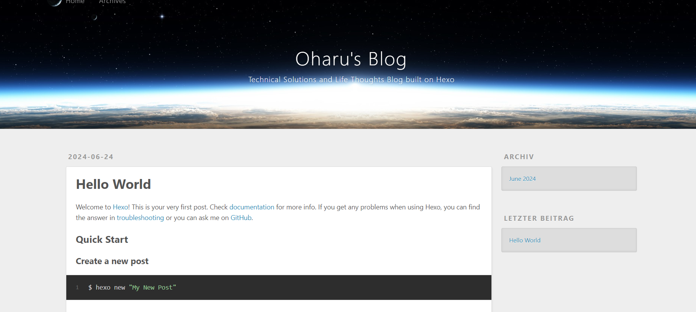
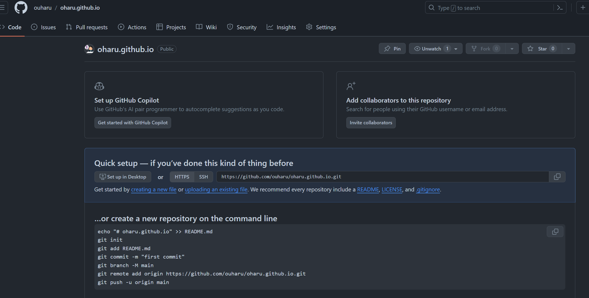
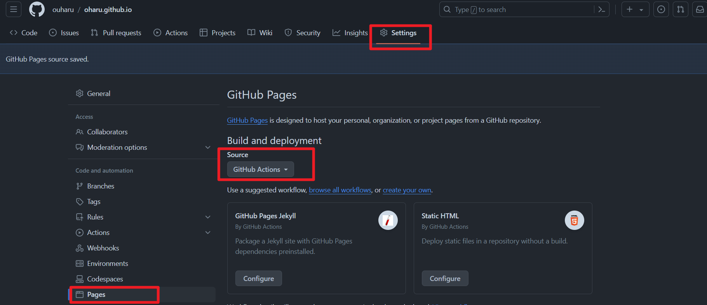

# 个人博客系统的搭建

[TOC]


## 当初

兜兜转转最终还是决定用hexo搭建，20年的时候曾经跟着视频教程搭建过，感觉每次在命令行里敲命令进行博客创作**发布维护太不优雅**了，加上自己本来**没有什么想要分享展示**的想法，个人博客项目就此中止。
期间也有试过csdn、博客园等国内社区型博客网站，qiita、zenn、hatena等日本技术博客分享网站，终因为写作体验不好加上没能坚持（懒，加上没有持续学习持续产出分享）而作罢。hugo、gridea等一些与hexo类似的工具也体验过，当时就是跟着视频花了x分钟做出来后，并没有体会到与hexo相比明显的优势，再加上对之前所写内容没有维护和备份，导致自己在写作这件事上一直是无数次从0开始而感到厌倦，跟着换主题搞的**花里胡哨**也不是我的目的，博客生涯告一段落。

## 现在

想起搭建博客是搜索技术问题解决方案时看到别人几年积累的博客就像是其个人的生平一样详实，对博主本人了解的兴趣大增，就自己而言若能有个记录自己之前积累的技术和想法的地方也不错。手写日记也是一种方法，但放在互联网上，能**随时搜索查阅**，比日记的展示效果又强了些，还能作为**知识库帮着查漏补缺**。同时不买服务器不买域名等一些附带展示自己折腾能力的额外花费，仅通过github pages发布。这里想到曾经看过一个大佬聊到为什么要这样：人可能没了，大概率github还在，那他写的文章就能活着，**在这个世界上留下痕迹**。或许比人死了不能续费博客404要好一点？好吧，其实就是把博客这件事的中心集中在写和分享上，也不是各种熟练搭建、美化和炫技上，当然一个漂亮的博客也更能吸引眼球，但咱个人的目的还是**写下对自己有用的**，可以时常拿来给自己和别人分享的知识和想法，在这上面可以花精力，但尽可能少的花钱和时间。

## 为什么是Hexo

这么多年过去了，它依旧是最简洁方便的，看了下doc大体上描述比较清晰（好吧，比起hugo、vuepress比较简单易懂，没有那么混乱，后面需要升级迁移再看看其它的方案吧），加上最近b站有up主在更新搭建指南和解决bug的[视频](https://www.bilibili.com/video/BV1xTgTemEDU/?share_source=copy_web&vd_source=f337ed634aad4136ce7b9c860e5d53bc)，自己可以跟着尝试一下(人家行，咱也行)。大体的搭建路线：

0. [依赖安装](#0. 依赖安装)
1. [Hexo本地安装](#1.Hexo本地安装)
2. [localhost测试](#2. localhost测试)
3. [github actions自动化发布到github pages](#3. github actions自动化发布到github pages)
4. [解决typora写作时图片显示问题](#4. 解决typora写作时图片显示问题)
5. 


# 0. 依赖安装

> ref: https://hexo.io/docs/

- Node.js (推荐LTS v20)

    - windows安装方式：[nvs](https://github.com/jasongin/nvs/) node switcher manager (官方推荐)

    ```powershell
    PS C:\Users\cwang84> nvs add latest  //安装latest version of node
    Downloading [################################################################] 100%
    Extracting  [################################################################] 100%
    Added at: $env:LOCALAPPDATA\nvs\node\22.3.0\x64\node.exe
    To use this version now: nvs use node/22.3.0/x64
    PS C:\Users\cwang84> nvs ls //显示nvs指定的node版本
      node/22.3.0/x64
    PS C:\Users\cwang84> nvs //切换node版本
    PATH += $env:LOCALAPPDATA\nvs\node\22.3.0\x64
    PS C:\Users\cwang84> node -v //显示当前node版本
    v22.3.0
    PS C:\Users\cwang84> nvs link //永久添加到path
    $env:LOCALAPPDATA\nvs\default -> $env:LOCALAPPDATA\nvs\node\22.3.0\x64
    User profile PATH += $env:LOCALAPPDATA\nvs\default
    ```

- [Git](https://git-scm.com/download/win)

```shell
C:\Users\cwang84>git --version
git version 2.45.2.windows.1
```

# 1.Hexo本地安装

> ref: https://hexo.io/docs/#Install-Hexo , https://hexo.io/docs/setup , https://hexo.io/docs/configuration

```powershell
PS C:\Users\cwang84> npm install -g hexo-cli
added 53 packages in 12s
PS C:\Users\cwang84\Desktop\Typora> hexo init hexo-blog
INFO  Cloning hexo-starter https://github.com/hexojs/hexo-starter.git
INFO  Install dependencies
INFO  Start blogging with Hexo!
PS C:\Users\cwang84\Desktop\Typora> cd .\hexo-blog\
PS C:\Users\cwang84\Desktop\Typora\hexo-blog> ls
Mode                 LastWriteTime         Length Name
----                 -------------         ------ ----
d-----        2024/06/24     23:14                .github
d-----        2024/06/24     23:15                node_modules
d-----        2024/06/24     23:14                scaffolds //脚手架，post构建模板？
d-----        2024/06/24     23:14                source //放置网站内容
d-----        2024/06/24     23:14                themes //主题文件夹。Hexo 通过将网站内容与主题相结合来生成静态网站。
-a----        2024/06/24     23:14             89 .gitignore
-a----        2024/06/24     23:15          94975 package-lock.json
-a----        2024/06/24     23:14            641 package.json //应用程序数据，渲染器
-a----        2024/06/24     23:14              0 _config.landscape.yml
-a----        2024/06/24     23:14           2547 _config.yml //配置文件


PS C:\Users\cwang84\Desktop\Typora\hexo-blog> npm install
added 1 package, and audited 227 packages in 2s

```

## _config.yml 配置

```powershell
# Hexo Configuration
## Docs: https://hexo.io/docs/configuration.html
## Source: https://github.com/hexojs/hexo/

# Site
title: Oharu's Blog
subtitle: "Technical Solutions and Life Thoughts Blog built on Hexo"
description: "Welcome to Oharu's blog. Here, I document solutions to daily technical issues and share my thoughts on life. This space is dedicated to sharing knowledge about technology and insights into my life."
keywords: IT Jobs,Life in Japan,Developer,Tech Blog,Life Thoughts
author: Oharu
language: zh
timezone: 'Japan'

# URL
## Set your site url here. For example, if you use GitHub Page, set url as 'https://username.github.io/project'
url: http://example.com
permalink: :year-:month-:day-:title.html
permalink_defaults:
pretty_urls:
  trailing_index: true # Set to false to remove trailing 'index.html' from permalinks
  trailing_html: true # Set to false to remove trailing '.html' from permalinks

# Directory
source_dir: source
public_dir: public
tag_dir: tags
archive_dir: archives
category_dir: categories
code_dir: downloads/code
i18n_dir: :lang
skip_render:

# Writing
new_post_name: :title.md # File name of new posts
default_layout: post
titlecase: false # Transform title into titlecase
external_link:
  enable: true # Open external links in new tab
  field: site # Apply to the whole site
  exclude: ''
filename_case: 0
render_drafts: false
post_asset_folder: true
relative_link: false
future: true
syntax_highlighter: highlight.js
highlight:
  line_number: true
  auto_detect: false
  tab_replace: ''
  wrap: true
  hljs: false
prismjs:
  preprocess: true
  line_number: true
  tab_replace: ''

# Home page setting
# path: Root path for your blogs index page. (default = '')
# per_page: Posts displayed per page. (0 = disable pagination)
# order_by: Posts order. (Order by date descending by default)
index_generator:
  path: ''
  per_page: 10
  order_by: -date

# Category & Tag
default_category: uncategorized
category_map:
tag_map:

# Metadata elements
## https://developer.mozilla.org/en-US/docs/Web/HTML/Element/meta
meta_generator: true

# Date / Time format
## Hexo uses Moment.js to parse and display date
## You can customize the date format as defined in
## http://momentjs.com/docs/#/displaying/format/
date_format: YYYY-MM-DD
time_format: HH:mm:ss
## updated_option supports 'mtime', 'date', 'empty'
updated_option: 'mtime'

# Pagination
## Set per_page to 0 to disable pagination
per_page: 10
pagination_dir: page

# Include / Exclude file(s)
## include:/exclude: options only apply to the 'source/' folder
include:
exclude:
ignore:

# Extensions
## Plugins: https://hexo.io/plugins/
## Themes: https://hexo.io/themes/
theme: landscape

# Deployment
## Docs: https://hexo.io/docs/one-command-deployment
deploy:
  type: ''

```

# 2. localhost测试

> ref: https://hexo.io/docs/server

```powershell
PS C:\Users\cwang84\OneDrive - DXC Production\Desktop\Typora\hexo-blog> hexo server
INFO  Validating config
INFO  Start processing
INFO  Hexo is running at http://localhost:4000/ . Press Ctrl+C to stop.
INFO  See you again		
```



# 3. github actions自动化发布到github pages

今后hexo文件夹更新commit后，blog即可在github actions的作用下自动更新

## 1. 创建***username\*.github.io** 仓库(username：ouharu)



## 2. hexo-blog 文件夹 push 到 username.github.io 仓库

```powershell
/hexo-blog (main)
$ git remote add origin https://github.com/ouharu/oharu.github.io.git
git branch -M main
git push -u origin main

Enumerating objects: 17, done.
Counting objects: 100% (17/17), done.
Delta compression using up to 12 threads
Compressing objects: 100% (10/10), done.
Writing objects: 100% (17/17), 27.90 KiB | 3.49 MiB/s, done.
Total 17 (delta 0), reused 0 (delta 0), pack-reused 0 (from 0)
To https://github.com/ouharu/oharu.github.io.git
 * [new branch]      main -> main
branch 'main' set up to track 'origin/main'.

```

## 3. 切换node版本到20（github action兼容性考虑）

```powershell
PS C:\Users\cwang84> nvs
PATH += $env:LOCALAPPDATA\nvs\node\20.15.0\x64
PS C:\Users\cwang84> node -v
v20.15.0
```

## 4. github repo 设置，创建github actions 代码

In your GitHub repo’s setting, navigate to **Settings** > **Pages** > **Source**. Change the source to **GitHub Actions** and save.


创建.github/workflows/pages.yml

```yaml
# https://github.com/ouharu/ouharu.github.io/blob/main/.github/workflows/pages.yml
name: Pages

on:
  push:
    branches:
      - main  # default branch

jobs:
  build:
    runs-on: ubuntu-latest
    steps:
      - uses: actions/checkout@v4
        with:
          token: ${{ secrets.GITHUB_TOKEN }}
          # If your repository depends on submodule, please see: https://github.com/actions/checkout
          submodules: recursive
      - name: Use Node.js 20
        uses: actions/setup-node@v4
        with:
          # Examples: 20, 18.19, >=16.20.2, lts/Iron, lts/Hydrogen, *, latest, current, node
          # Ref: https://github.com/actions/setup-node#supported-version-syntax
          node-version: '20'
      - name: Cache NPM dependencies
        uses: actions/cache@v4
        with:
          path: node_modules
          key: ${{ runner.OS }}-npm-cache
          restore-keys: |
            ${{ runner.OS }}-npm-cache
      - name: Install Dependencies
        run: npm install
      - name: Build
        run: npm run build
      - name: Upload Pages artifact
        uses: actions/upload-pages-artifact@v3
        with:
          path: ./public
  deploy:
    needs: build
    permissions:
      pages: write
      id-token: write
    environment:
      name: github-pages
      url: ${{ steps.deployment.outputs.page_url }}
    runs-on: ubuntu-latest
    steps:
      - name: Deploy to GitHub Pages
        id: deployment
        uses: actions/deploy-pages@v4
```

保存后`https://github.com/ouharu/ouharu.github.io/actions`check 执行结果，访问`https://ouharu.github.io/`

## *出现css样式无法加载的问题

解决方法：_config.yml更新url:

```yaml
url: https://ouharu.github.io/
```

# 4. 解决typora写作时图片显示问题

