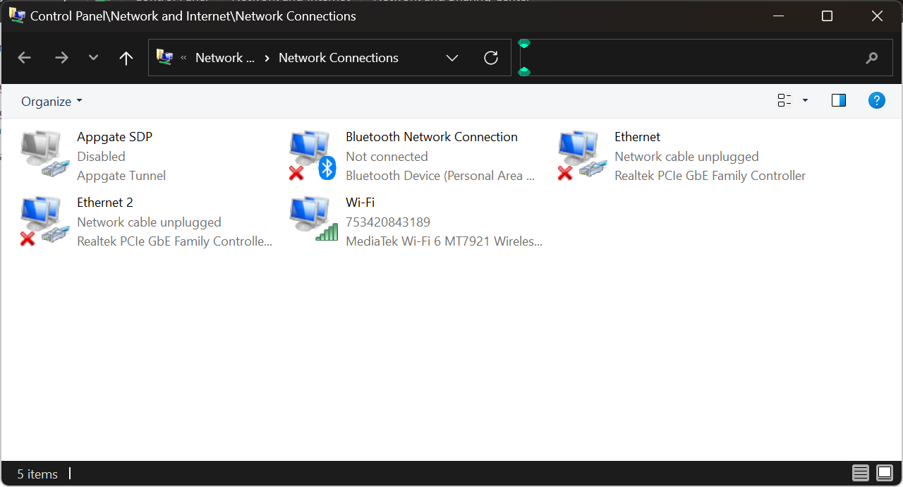
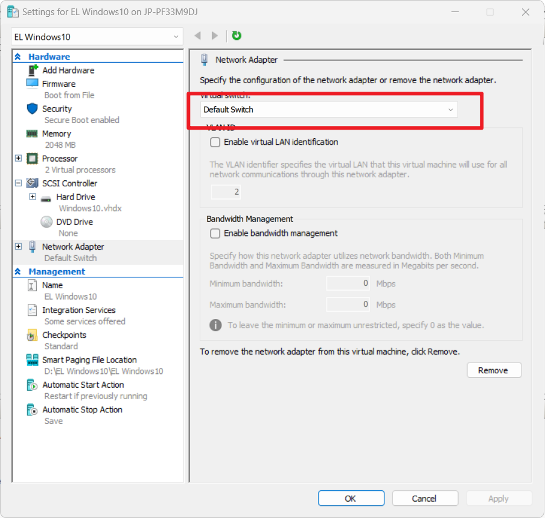

本文解决了hyper-V用default switch不能联网的问题

## 问题

打开 hyper-v manager ， 启动并连接虚拟机，发现无法联网，而之前公司电脑升级win11后发现可以不通过外部switch仅通过自带的default switch也能连上外网。

因为外部模式下物理机网卡和虚拟网卡皆通过桥接虚拟交换机连接外部网络的方式影响电脑的网络配置，在发现default switch可以联网后就一直采取此模式在hyper-v上进行联网。

但是该方法偶尔连接虚拟机后发现无法联网。

## 解决思路

原因可能跟windows内部的权限设置或公司合规设置有关，之前在win10下无法进行default switch联网，win11却可以。

通过一系列测试，发现在运行hyper-V时需要进行以下设置：
1. 关闭任何VPN和网络适配器，采用直连网络。（通过观察adapter管理界面确定只有一个适配器处于连接状态）

2. hyper-V manager 采用【以管理员身份运行】模式打开。
3. 确认虚拟机的网络适配器选中Default Switch

---
完
