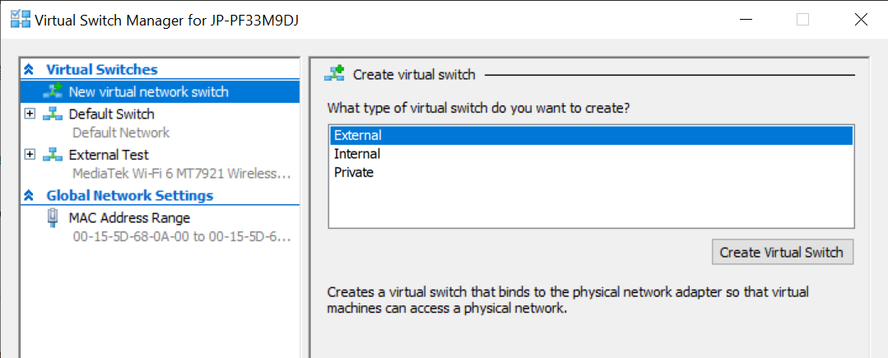
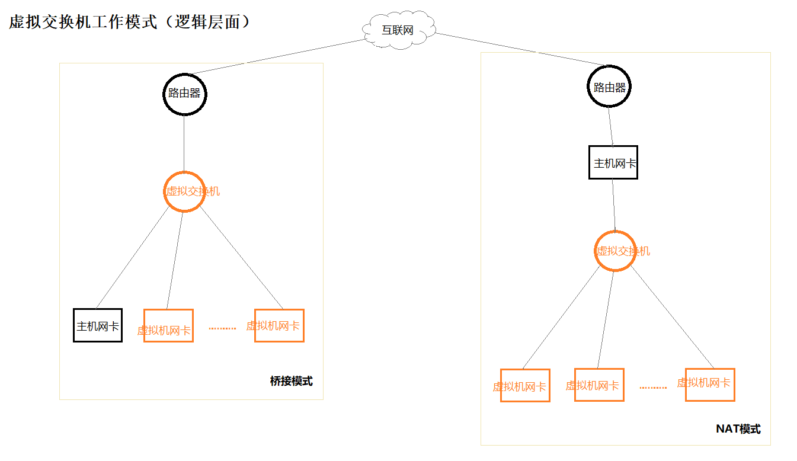
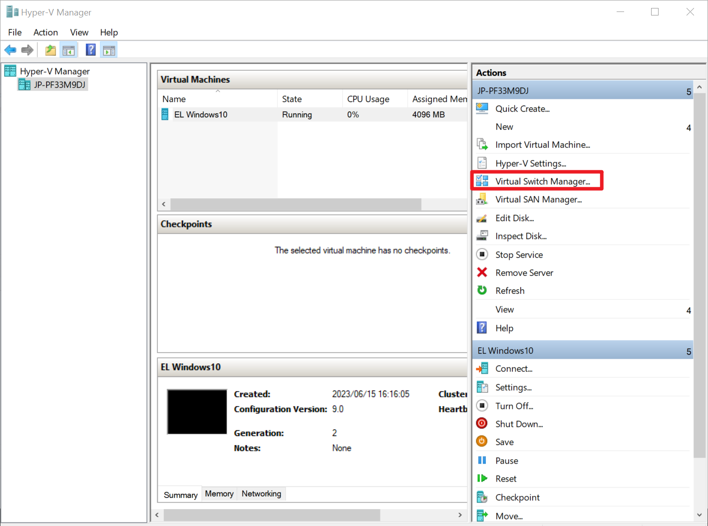
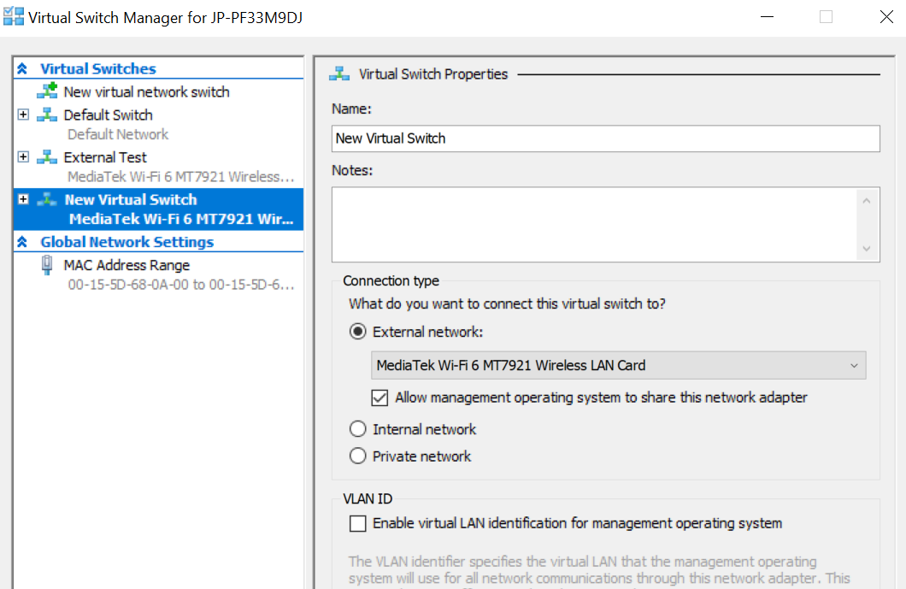
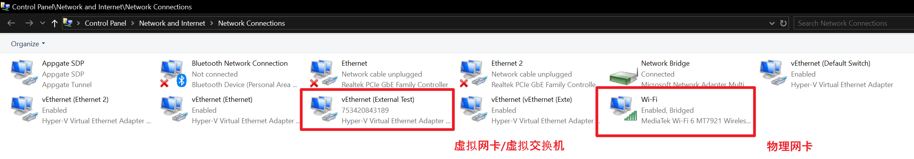
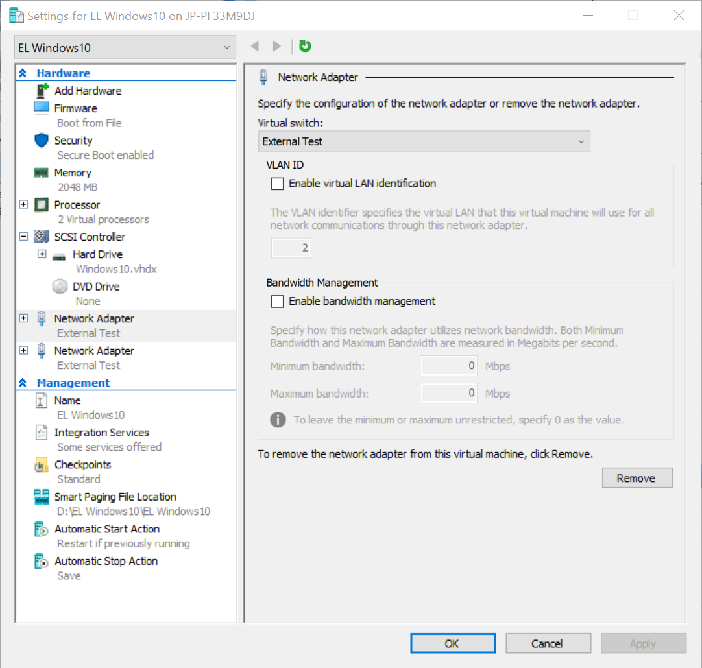

> 参考： https://www.cnblogs.com/Ganders/p/16522314.html

Hyper-V中虚拟机连网需要对Virtual Switch Manager 虚拟交换机管理平台进行设置。

Hyper-V虚拟机管理平台提供了三种虚拟交换机：

- 外部（bridge）：该模式下虚拟机与主机同级别，仿佛是同一局域网下的独立计算机，虚拟机通过虚拟交换机访问外部网络。
- 内部（NAT）：该模式下虚拟机通过虚拟交换机与主机进行端口映射，进而访问外部网络，交换机用于虚拟机与主机之间的连接，虚拟机更像是位于主机的子网中。
- 专用（host-only）：该交换机只负责虚拟机之间的通讯。

由于公司电脑对网络环境设置有policy限制，无法使用NAT内部设置，这里展示外部类型的虚拟交换机的网络设置。图中左侧可以看出，外部桥接模式下，虚拟交换机置于主机物理网卡和虚拟网卡之前，负责外网和网卡之间的通信。

## 1.外部桥接虚拟交换机的设置

- 打开Hyper-V Manager
- 打开右侧 Virtual Switch Manager，选择External，点击 Create Virtual Switch
- Name随意填（注意与其它交换机区分），Connnection Type 选中 External network并选择当前联网的物理网卡（这里笔记本wifi联网，选择WiFi网卡），allow share this network adapter选中
- OK

最终会在Hyper-V中创建Virtual Switch的同时，在Control Panel\Network and Internet\Network Connections网络适配器部分创建一个同名的适配器

## 2. 虚拟机的设置

- 在Hyper-V管理平台右下位置选择 VM Setting
- 选择左侧 Network Adapter
- Virtual Swtich  选择上面创建的 External Swtich
- OK

## 3.观察联网情况

- 打开Control Panel\Network and Internet\Network Connections网络适配器
- 出现桥接器 Network Bridge
- 打开setting/Netowrk&Internet/Status，观察物理主机通过 Virtual Switch 连接外网，Virtual Switch 和 WiFi物理网卡进行了桥接

## 4.测试虚拟机联网情况

如果网络适配器中WiFi物联网卡，桥接器，虚拟网卡(虚拟交换机)三者显示已连接，虚拟机就可以成功联网。

---
完