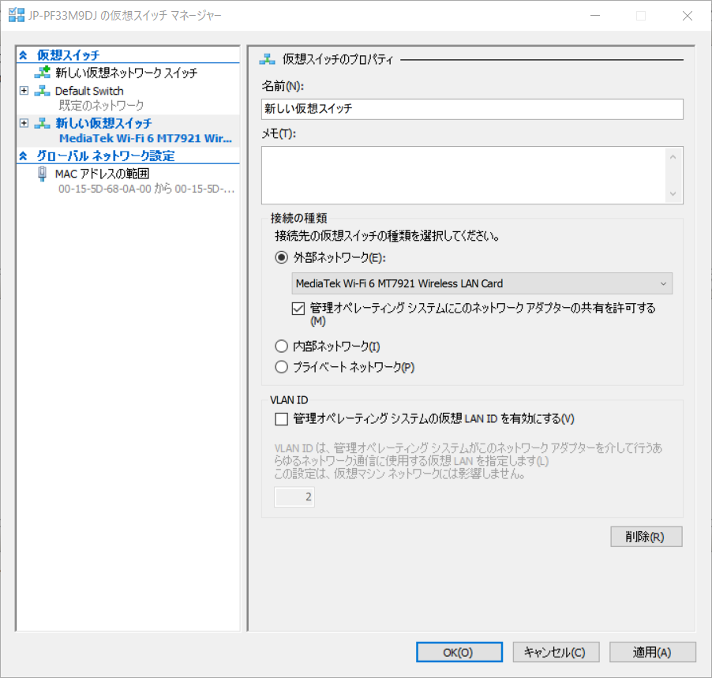
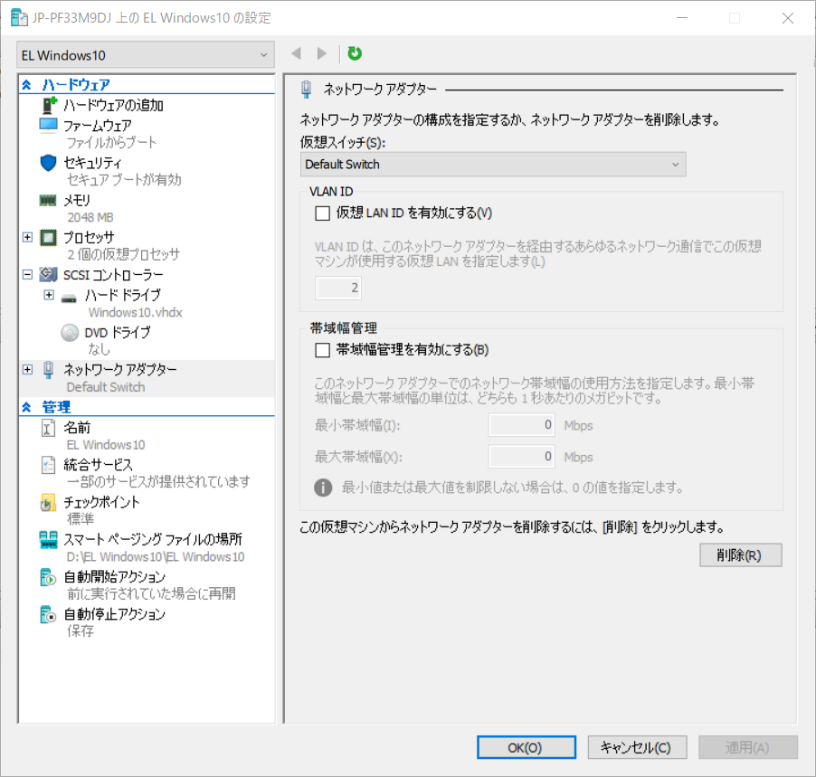
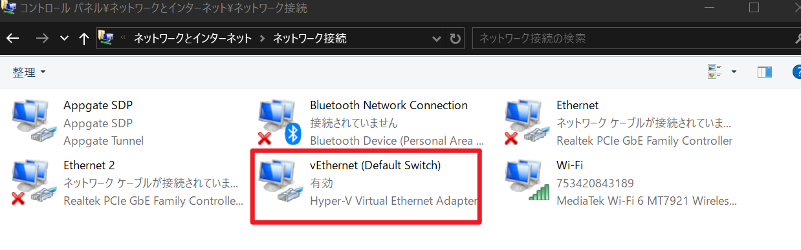
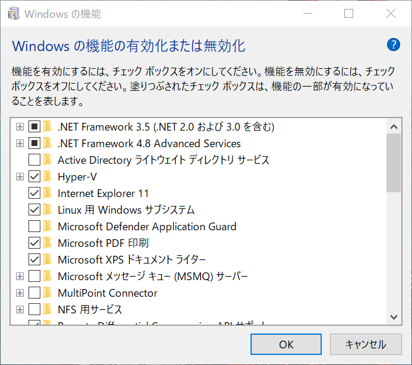
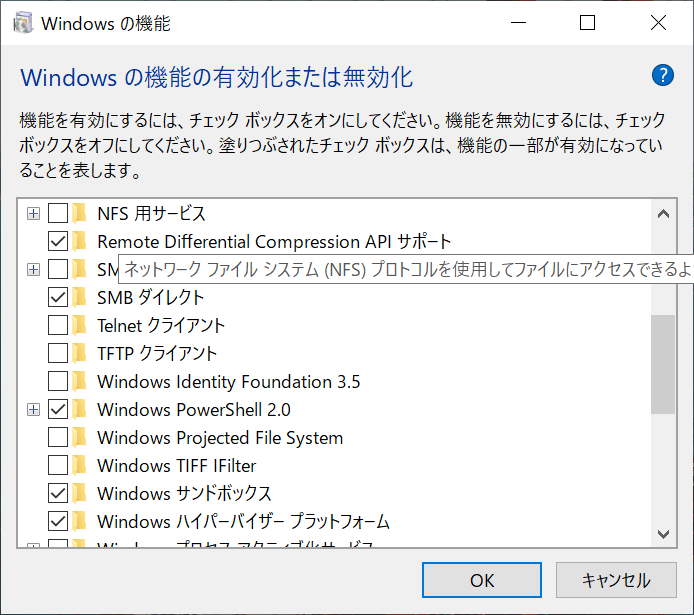
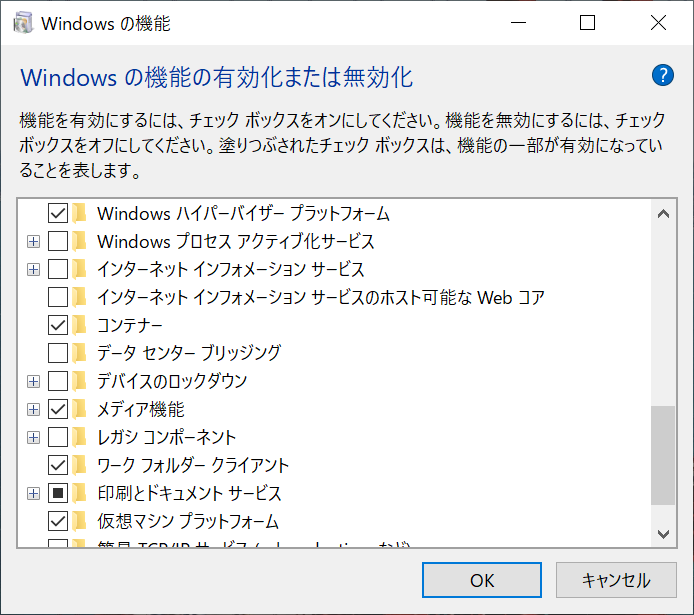

> 参考：https://stea.hatenablog.com/entry/2020/12/20/020723

打工人工作忙，直接跳解决方案

# 起因

工作上客户的环境需要虚拟机里装的vpn连接，上司用的hyper-v，将他电脑上虚拟机文件导出为.vhdx文件可以直接在本机hyper-v上导入运行。
第一次使用，无痛无坑导入成功（需要注意导入文件夹时，.vhdx文件需要位于下一级文件夹中。这个只是推论，没有实际证明过。但文件位于下下级目录中就无法识别这一点踩过坑。）

虚拟机启动成功后就是网络问题，无脑【虚拟交换机管理】中设置外部网络并指向当前网络用的网卡：

然后在hyper-v虚拟机设定中网络适配器选择上面添加的虚拟交换机。之后hyper-v中的虚拟机就会连上网。虽然不明白原理，总而言之有能等客户环境的虚拟机了。

注意：在hyper-v设置的同时，在网络-网络适配器中也会产生相应的适配器图标，其中vEthernet(Default Switch)是hyper-v自带的适配器，可能在开启hyper-v功能后生成的（未经证实，但如果没有这玩意hyper-v等于费了）

# 问题

以上设置都是在家连着wifi完成的，周日突发奇想背着电脑到公司，发现连不上网络，明明显示连上但不走流量。打开网络适配器发现电脑和Internet之间通过外部switch连接，wifi网卡中显示桥接，what!??
将WiFi网卡中的桥接取消，电脑连接网络正常，结果虚拟机又连不上网了。
经过一系列虚拟交换机的删除操作，结果成功造成了一下问题：

- 点击【虚拟交换机管理】显示错误：
    - 仮想スイッチの一覧の取得中にエラーが発生
    - 尝试检索虚拟交换机列表时出错
    - Error Occurred Trying to Retrieve a List of Virtual Switches
- 由此引发了一系列错误
    - 无法快速创建虚拟机，显示 generic error
    - 无法导入虚拟机

周日搞了一晚上，试了无数方法，未能解决。。。

# 原因

删除虚拟交换机的骚操作导致默认交换机Default Swtich被删除，结果hyper-v找不到虚拟交换机，自然找不到列表。。。而一系列引发的错误都是为了找Default Switch，在创建虚拟机时要确认网络设置情况，没有就会出错。

# 解决

调查了很多方法，最终没有在网上找到解决适合我的解决方法。有些和我产生了相同的问题，但用对方的方法不管用，或是因为产生的原因不同？这里有一个最接近我的解决方法的日本博主，感谢他，虽然用他的方法没成功，但是也就差了一两个Windows功能的开启关闭。
参考：https://stea.hatenablog.com/entry/2020/12/20/020723

思路就是重装Hyper-V以及关联的软件/功能。由于Hyper-V属于Windows系统自带功能，只存在开启/关闭，所以只能通过关闭重启再开启重启解决，很多方法都是基于这个思路。但是仅仅重启Hyper-V没用，总结一下关闭/打开列表（全部与虚拟化有关）：

- 「Hyper-V」
- 「Linux用Windowsサブシステム」Linux 子系统
- 「Windowsサンドボックス」 Windows沙箱
- 「Windowsハイパーバイザープラットフォーム」Windows Hypervisor Platform
- 「仮想マシンプラットフォーム」虚拟机平台
    ---以上为日本博主的解决方案，我还要加上👇----
- Container 容器

截图为证（Hyper-V功能恢复时开启的Windows功能）：

(可能只有Container和Hyper-V是有效的，但咱也不敢再测试验证了，公司电脑，本来都想着重装系统了。。。)

# 总结

问题解决了，不用重装系统了，但是问题的解决花费了很多时间，没有文档，没有错误代码，微软社区工作人员回答不专业，某技术用的人越少讨论话题度低，网上就没有太多相关资源可以参考，所以还是要用主流的技术。希望这篇文章可以帮助某些和我一样困惑许久的朋友。
下期写一下Hyper-V的网络配置问题。