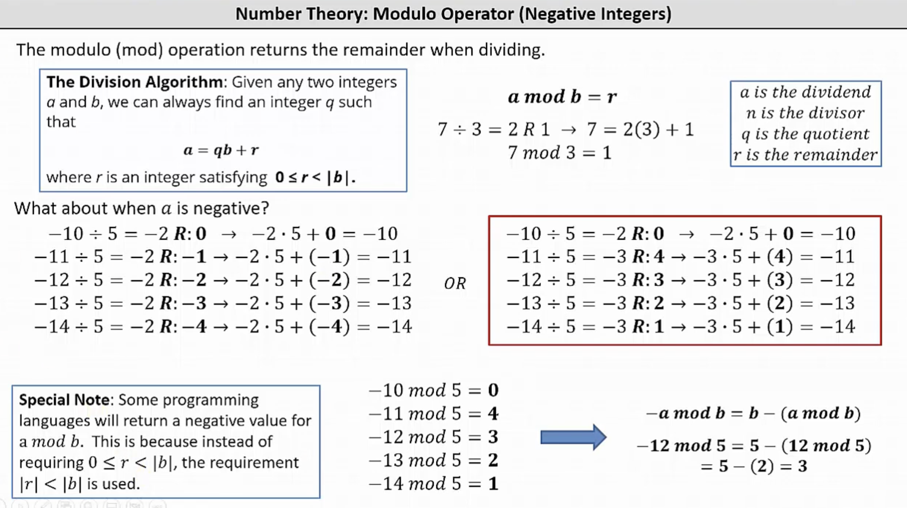

> 题目：<https://paiza.jp/career/challenges/61/retry>

# 问题

原题中矩阵游走时具备边缘流通性，即如果移动距离超出矩阵范围则从另一端进入，保证在矩阵范围内循环移动。

## 💭思路

要做到这一点，考虑移动后坐标取模运算后作为新的位置坐标。

## 🚫问题

考虑移动后坐标为负数的情况，即负数的取模运算。
Python中尊从以下原则：
取模运算结果r满足: r >= 0 and r <= abs(b)
[https://www.youtube.com/watch?v=hAfHwVqgLZs](https://www.youtube.com/watch?v=hAfHwVqgLZs)



## 🛠原因

不同编程语言对于a mod b(a为负数)时的运算定义不同：

- Java： -5%2=-1 ，商为-2，余数为-1
  - 遵循abs(r) < abs(b),商靠近0
- Python：-5%2=1 ，商为-3，余数为1
  - 遵循0 <= r < abs(b),商远离0

拓展：b为负数的情况

- Java： 5%-2=1 ，商为-2，余数为1
  - 遵循abs(r) < abs(b),商靠近0
- Python：5%-2=-1 ，商为-3，余数为-1
  - 遵循0 <= abs(r) < abs(b) ,商远离0

## ✅解决

代码如下：

```python
w,h,n = map(int,input().split())
x,y = map(int,input().split())


def cal_next(pos:int,length:int,dist:int) -> int:
    return (pos + dist) % length

for _ in range(n):
    dir,dist = input().split()
    if dir == 'U':
        y = cal_next(y,h,int(dist))
    elif dir == 'D':
        y = cal_next(y,h,-int(dist))
    elif dir == 'L':
        x = cal_next(x,w,-int(dist))
    elif dir == 'R':
        x = cal_next(x,w,int(dist))
        
print(x,y)
```

---
完
