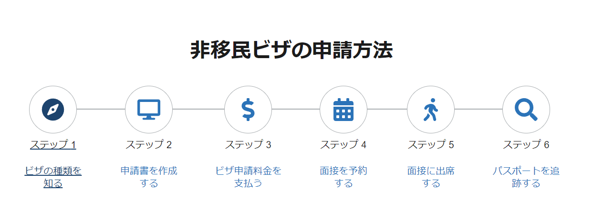
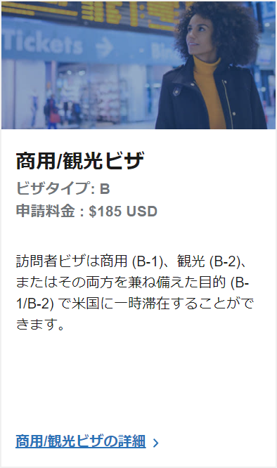

参考：https://youtu.be/tEDiA5eCWm8?feature=shared

# 1.美国签证的好处

- 十年签证，有效期可超过护照有效期（加拿大不行）
- 无需财产证明？
- 南美等多个国家可免签
- 续签简单，无需重新提供资料
- 可办理美国信用卡
- 可赚机票钱，例如帮人托运宠物？
- 70岁以上老人10岁以下小孩可免面谈
- 赴美生孩

# 2.美签申请官网

https://www.ustraveldocs.com/

https://www.ustraveldocs.com/jp/ja/

EVUS 赴美前需要申请填写

# 3.DS160表格填写

https://www.ustraveldocs.com/jp/ja/step-2#ds160-guidelines

# 4.缴纳签证申请费用

- 需要注册账户

# 5.证明材料

- 护照

- DS160 打印表格（申请表格+确认表格）

- 面试预约确认表

- 在留卡

- 简历？（）

- 旅行计划

- 照片（尺寸？5x5）

    -----以上必须-----

- 在职证明

- 存款证明

- 住民票

- 